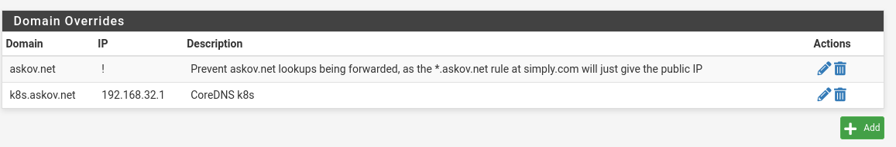

DNS server for LoadBalancer IPs
======================================

(Inspired by https://www.reddit.com/r/homelab/comments/ipsc4r/howto_k8s_metallb_and_external_dns_access_for/?rdt=40382)

This is both extremely difficult and surprisingly easy. The trick is to wrap you head around the weirdness of DNS.

The PFSense firewall is the normal DNS server for my LAN. I want it to resolve DNS requests like this
1. Do I have a host override for the specific host? -> Use Host Override
2. Do I have the specific host in DHCP? -> Use DHCP lease list
3. Do I have a domain override for the specific domain? -> Forward to DNS server for this domain
4. Forward to upstream (ISP) DNS servers

To get Kubernetes DNS working, we need to hook into step 3 in that list. To do this, we need to setup these 2 things:
1. Set up PFSense DNS Domain override to point to the Kubernetes DNS server
2. Set up CoreDNS in Kubernetes to respond to external requests

Step 1 is easy.

Read more about it at https://docs.netgate.com/pfsense/en/latest/services/dns/forwarder-overrides.html#domain-overrides

Since Kubernetes already comes with [CoreDNS](https://coredns.io/), all we need to do is expose it as a service and enable the [k8s_external](https://coredns.io/plugins/k8s_external/) plugin

Exposing coredns as a service via the MetalLB loadbalancer just requires us to apply 

```yaml
apiVersion: v1
kind: Service
metadata:
  name: ext-dns
  namespace: kube-system
  annotations:
    metallb.universe.tf/allow-shared-ip: "DNS"
    metallb.universe.tf/loadBalancerIPs: 192.168.32.1
spec:
  type: LoadBalancer
  ports:
    - name: dns
      port: 53
      targetPort: 53
      protocol: UDP
    - name: dns-tcp
      port: 53
      targetPort: 53
      protocol: TCP
  selector:
    k8s-app: kube-dns
```

Then we must reconfigure CoreDNS to use the `k8s_external` plugin.
In fact, all we need to do is add the line `k8s_external k8s.askov.net` to the config map `coredns`

*this change WILL be lost on restart*

The full configmap will then be
```yaml
apiVersion: "v1"
kind: "ConfigMap"
metadata:
  name: "coredns"
  namespace: "kube-system"
data:
  Corefile: |
    .:53 {
        errors
        health
        ready
        kubernetes cluster.local in-addr.arpa ip6.arpa {
          pods insecure
          fallthrough in-addr.arpa ip6.arpa
        }
        k8s_external k8s.askov.net {
          fallthrough
        }
        hosts /etc/coredns/NodeHosts {
          ttl 60
          reload 15s
          fallthrough
        }
        prometheus :9153
        forward . /etc/resolv.conf
        cache 30
        loop
        reload
        loadbalance
        import /etc/coredns/custom/*.override
    }
    import /etc/coredns/custom/*.server
  NodeHosts: |
    192.168.4.4 k8smaster1.k8s.askov.net
    192.168.4.10 k8snode1.k8s.askov.net
    192.168.4.20 k8snode2.k8s.askov.net
```

The line `k8s_external k8s.askov.net` instructs CoreDNS to load the `k8s_external` plugin and become a DNS server for the given domain (`k8s.askov.net`), and thus respond to requests with the given Load Balancer IP.

Note: In order for us to preserve the change on reboot, we rather have to create a new configmap (see <https://docs.digitalocean.com/products/kubernetes/how-to/customize-coredns/>)
```yaml
apiVersion: v1
kind: ConfigMap
metadata:
  name: coredns-custom
  namespace: kube-system
data:
  k8s_external.override: |
    k8s_external k8s.askov.net {
      fallthrough
    }
```
This will hook into the `import /etc/coredns/custom/*.override` statement from the original config map.

With this change, we can immediately see that we can resolve the `test` service as both `test.default.svc.cluster.local` and `test.default.k8s.askov.net`

(note: You might have to restart the coredns pods (just delete them))

> TODO: If the host's `/etc/resolv.conf` have multiple nameservers, coredns will forward to them round-robin style.
> See https://github.com/coredns/coredns/issues/3147
> 
> replace 
> `forward . /etc/resolv.conf`
> with 
> ```
>         forward . /etc/resolv.conf {
>           policy sequential
>         }
> ```
> to fix this. 
> This "bug" took a fun afternoon to diagnose. 
> 

```
[aabl@k8smaster1 ~]$ nslookup test.default.svc.cluster.local 192.168.32.1
Server:		192.168.32.1
Address:	192.168.32.1#53

Name:	test.default.svc.cluster.local
Address: 10.43.129.111

[aabl@k8smaster1 ~]$ 
[aabl@k8smaster1 ~]$ nslookup test.default.k8s.askov.net 192.168.32.1
Server:		192.168.32.1
Address:	192.168.32.1#53

Name:	test.default.k8s.askov.net
Address: 192.168.32.2

[aabl@k8smaster1 ~]$ 
```

When performing the lookup from my local workstation it also works
(here 192.168.2.1 is the pfsense firewall ip)
```
aabl@fedora:~$ nslookup test.default.k8s.askov.net 192.168.2.1
Server:		192.168.2.1
Address:	192.168.2.1#53

Name:	test.default.k8s.askov.net
Address: 192.168.32.2

aabl@fedora:~$ 
aabl@fedora:~$ nslookup test.default.k8s.askov.net 192.168.32.1
Server:		192.168.32.1
Address:	192.168.32.1#53

Name:	test.default.k8s.askov.net
Address: 192.168.32.2

aabl@fedora:~$ 
```

And we can thus access the service by it's DNS name
```
aabl@fedora:~$ curl test.default.k8s.askov.net
<!DOCTYPE html>
<html>
<head>
<title>Welcome to nginx!</title>
<style>
html { color-scheme: light dark; }
body { width: 35em; margin: 0 auto;
font-family: Tahoma, Verdana, Arial, sans-serif; }
</style>
</head>
<body>
<h1>Welcome to nginx!</h1>
<p>If you see this page, the nginx web server is successfully installed and
working. Further configuration is required.</p>

<p>For online documentation and support please refer to
<a href="http://nginx.org/">nginx.org</a>.<br/>
Commercial support is available at
<a href="http://nginx.com/">nginx.com</a>.</p>

<p><em>Thank you for using nginx.</em></p>
</body>
</html>
aabl@fedora:~$ 
```
