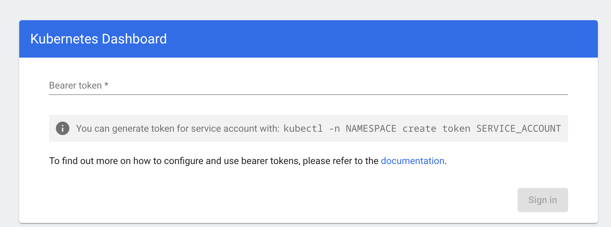

Kubernetes Dashboard
==========================

First, we install the dashboard

Add kubernetes-dashboard repository
```
aabl@fedora:~$ helm repo add kubernetes-dashboard https://kubernetes.github.io/dashboard/
"kubernetes-dashboard" has been added to your repositories
aabl@fedora:~$
```

Deploy a Helm Release named "kubernetes-dashboard" using the kubernetes-dashboard chart
```
aabl@fedora:~$ helm upgrade --install kubernetes-dashboard kubernetes-dashboard/kubernetes-dashboard --create-namespace --namespace kubernetes-dashboard
Release "kubernetes-dashboard" does not exist. Installing it now.
NAME: kubernetes-dashboard
LAST DEPLOYED: Sun Jan  5 19:42:47 2025
NAMESPACE: kubernetes-dashboard
STATUS: deployed
REVISION: 1
TEST SUITE: None
NOTES:
*************************************************************************************************
*** PLEASE BE PATIENT: Kubernetes Dashboard may need a few minutes to get up and become ready ***
*************************************************************************************************

Congratulations! You have just installed Kubernetes Dashboard in your cluster.

To access Dashboard run:
  kubectl -n kubernetes-dashboard port-forward svc/kubernetes-dashboard-kong-proxy 8443:443

NOTE: In case port-forward command does not work, make sure that kong service name is correct.
      Check the services in Kubernetes Dashboard namespace using:
        kubectl -n kubernetes-dashboard get svc

Dashboard will be available at:
  https://localhost:8443
aabl@fedora:~$ 
```

Access the Dashboard
--------------------------
Okay, we now have a dashboard, but how do we access it?

### Routing

Well, this is quite simple, given all we have set up so far. We just need to create a Service/LoadBalancer object and then MetalLB and pfsense will handle the routing and DNS magic

```yaml
apiVersion: v1
kind: Service
metadata:
  name: kubernetes-dashboard
  namespace: kubernetes-dashboard
spec:
  ports:
    - port: 443
      protocol: TCP
      targetPort: 8443
  selector:
    app.kubernetes.io/component: app
    app.kubernetes.io/instance: kubernetes-dashboard
    app.kubernetes.io/name: kong
  type: LoadBalancer
```

### Service Account
So now we can open <https://kubernetes-dashboard.kubernetes-dashboard.k8s.askov.net/> in our browser. We still get an error about selfsigned Untrusted certificate, but this will be fixed in another episode. When we click through the problem, however, we are greeted by this screen


We follow the guide from <https://github.com/kubernetes/dashboard/blob/master/docs/user/access-control/creating-sample-user.md>

Step 1 is creating a `ServiceAccount`, with content like

```yaml
apiVersion: v1
kind: ServiceAccount
metadata:
  name: admin-user
  namespace: kubernetes-dashboard
```

Then we need to setup the `ClusterRoleBinding`, i.e. which specify the cluster roles (containing permissions) to grant to our `ServiceAccount`. This can be done with this object

```yaml
apiVersion: rbac.authorization.k8s.io/v1
kind: ClusterRoleBinding
metadata:
  name: admin-user
roleRef:
  apiGroup: rbac.authorization.k8s.io
  kind: ClusterRole
  name: cluster-admin
subjects:
  - kind: ServiceAccount
    name: admin-user
    namespace: kubernetes-dashboard
```

And finally we can produce a `ServiceToken` for this `ServiceAccount` with the command

```bash
kubectl -n kubernetes-dashboard create token admin-user
```
This is the token we need to log into the dashboard

### Persistent token
The token generated above is not persisted and have a server-defined duration (TODO how to check the duration?)

To generate a persistent token, we must create a `Secret` with a special annotation. Kubernetes will then populate the secret with the token and this token will remain valid as long as the secret exists.

```yaml
apiVersion: v1
kind: Secret
metadata:
  name: kubernetes-dashboard-serviceaccount-secret
  namespace: kubernetes-dashboard
  annotations:
    kubernetes.io/service-account.name: admin-user
type: kubernetes.io/service-account-token
```

We can then retrieve the token with
```bash
kubectl get secret kubernetes-dashboard-serviceaccount-secret -n kubernetes-dashboard -o jsonpath="{.data.token}" | base64 -d
```