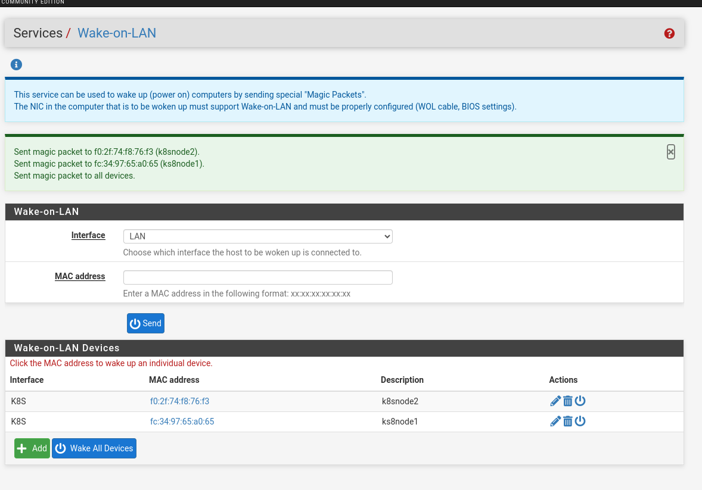

Kubernetes
=================

For the initial setup, we want to use [K3s](https://docs.k3s.io), as it is simpler to get running than a full Kubernetes-from-scratch environment.

Preparation
----------------
We want to follow https://docs.k3s.io/installation/requirements?os=rhel

For the first install, we just disable the host firewalls. Later on, I will look into getting firewalls integrated, but now I just want something working

```
[root@k8smaster1 ~]# systemctl disable firewalld --now

Removed "/etc/systemd/system/multi-user.target.wants/firewalld.service".
Removed "/etc/systemd/system/dbus-org.fedoraproject.FirewallD1.service".
[root@k8smaster1 ~]# 
```


Install K3s
----------------

You start the install of K3s with just the command
```bash
curl -sfL https://get.k3s.io | sh -
```

It is, of course, not a good security principle to `curl` something directly into `bash` execution, but more and more systems are starting to work like this.

If you want to provide parameters for the installation, you can do it like
`curl -sfL https://get.k3s.io | sh -s -- --key=value`

But as you need to specify the same parameters on all nodes, this can easily become tiresome. So instead we will use a config file.


### Config: Allowing user access to kubectl

`/etc/rancher/k3s/config.yaml`
```yaml
write-kubeconfig-group: "wheel"
write-kubeconfig-mode: "0640"
```
This ensures that the file `/etc/rancher/k3s/k3s.yaml` is readable by my user.


### Disable ServiceLB

https://docs.k3s.io/networking/networking-services#traefik-ingress-controller

Any LoadBalancer controller can be deployed to your K3s cluster. By default, K3s provides a load balancer known as [ServiceLB](https://github.com/k3s-io/klipper-lb) (formerly Klipper LoadBalancer) that uses available host ports.

We want to use [MetalLB](https://metallb.io/) instead, as it can speak [BGP](https://en.wikipedia.org/wiki/Border_Gateway_Protocol) with PFSense and thus advertise the created services on the firewall. 

To disable ServiceLB, configure all servers in the cluster with the
` --disable=servicelb` flag.

So our config expands to:  

`/etc/rancher/k3s/config.yaml`
```yaml
write-kubeconfig-group: "wheel"
write-kubeconfig-mode: "0640"
disable:
  - servicelb
```

### Upload config

We can upload the config with a quick `rsync -av k3s/* --rsync-path="sudo rsync" -S k8smaster1:/ `

And then, on the node, start the install

```
[aabl@k8smaster1 ~]$ curl -sfL https://get.k3s.io | sh -
[INFO]  Finding release for channel stable
[INFO]  Using v1.30.5+k3s1 as release
[INFO]  Downloading hash https://github.com/k3s-io/k3s/releases/download/v1.30.5+k3s1/sha256sum-amd64.txt
[INFO]  Downloading binary https://github.com/k3s-io/k3s/releases/download/v1.30.5+k3s1/k3s
[INFO]  Verifying binary download
[INFO]  Installing k3s to /usr/local/bin/k3s
[INFO]  Finding available k3s-selinux versions
Rancher K3s Common (stable)                                                                                                                                                                         26 kB/s | 2.9 kB     00:00    
Dependencies resolved.
===================================================================================================================================================================================================================================
 Package                                                 Architecture                                 Version                                                Repository                                                       Size
===================================================================================================================================================================================================================================
Installing:
 k3s-selinux                                             noarch                                       1.6-1.el9                                              rancher-k3s-common-stable                                        22 k
Installing dependencies:
 container-selinux                                       noarch                                       3:2.229.0-1.el9                                        appstream                                                        56 k

Transaction Summary
===================================================================================================================================================================================================================================
Install  2 Packages

Total download size: 77 k
Installed size: 163 k
Downloading Packages:
(1/2): k3s-selinux-1.6-1.el9.noarch.rpm                                                                                                                                                            172 kB/s |  22 kB     00:00    
(2/2): container-selinux-2.229.0-1.el9.noarch.rpm                                                                                                                                                  353 kB/s |  56 kB     00:00    
-----------------------------------------------------------------------------------------------------------------------------------------------------------------------------------------------------------------------------------
Total                                                                                                                                                                                              168 kB/s |  77 kB     00:00     
Running transaction check
Transaction check succeeded.
Running transaction test
Transaction test succeeded.
Running transaction
  Preparing        :                                                                                                                                                                                                           1/1 
  Running scriptlet: container-selinux-3:2.229.0-1.el9.noarch                                                                                                                                                                  1/2 
  Installing       : container-selinux-3:2.229.0-1.el9.noarch                                                                                                                                                                  1/2 
  Running scriptlet: container-selinux-3:2.229.0-1.el9.noarch                                                                                                                                                                  1/2 
  Running scriptlet: k3s-selinux-1.6-1.el9.noarch                                                                                                                                                                              2/2 
  Installing       : k3s-selinux-1.6-1.el9.noarch                                                                                                                                                                              2/2 
  Running scriptlet: k3s-selinux-1.6-1.el9.noarch                                                                                                                                                                              2/2 
  Running scriptlet: container-selinux-3:2.229.0-1.el9.noarch                                                                                                                                                                  2/2 
  Running scriptlet: k3s-selinux-1.6-1.el9.noarch                                                                                                                                                                              2/2 
  Verifying        : k3s-selinux-1.6-1.el9.noarch                                                                                                                                                                              1/2 
  Verifying        : container-selinux-3:2.229.0-1.el9.noarch                                                                                                                                                                  2/2 

Installed:
  container-selinux-3:2.229.0-1.el9.noarch                                                                               k3s-selinux-1.6-1.el9.noarch                                                                              

Complete!
[INFO]  Creating /usr/local/bin/kubectl symlink to k3s
[INFO]  Creating /usr/local/bin/crictl symlink to k3s
[INFO]  Creating /usr/local/bin/ctr symlink to k3s
[INFO]  Creating killall script /usr/local/bin/k3s-killall.sh
[INFO]  Creating uninstall script /usr/local/bin/k3s-uninstall.sh
[INFO]  env: Creating environment file /etc/systemd/system/k3s.service.env
[INFO]  systemd: Creating service file /etc/systemd/system/k3s.service
[INFO]  systemd: Enabling k3s unit
Created symlink /etc/systemd/system/multi-user.target.wants/k3s.service → /etc/systemd/system/k3s.service.
[INFO]  systemd: Starting k3s
[aabl@k8smaster1 ~]$ 
```

We can then perform some quick checks to see that the 1-node cluster is sane

#### Setup Bash Completion
`source <(kubectl completion bash)`

#### Get nodes
```
[aabl@k8smaster1 ~]$ kubectl get nodes
NAME                       STATUS   ROLES                  AGE   VERSION
k8smaster1.k8s.askov.net   Ready    control-plane,master   36s   v1.30.5+k3s1
[aabl@k8smaster1 ~]$ 
```
There is 1 node, as expected, and it is ready


#### Check for load balancer
We want to be sure that no Loadbalancer was installed yet
```
[aabl@k8smaster1 ~]$ kubectl get services -A
NAMESPACE     NAME             TYPE           CLUSTER-IP     EXTERNAL-IP   PORT(S)                      AGE
default       kubernetes       ClusterIP      10.43.0.1      <none>        443/TCP                      75s
kube-system   kube-dns         ClusterIP      10.43.0.10     <none>        53/UDP,53/TCP,9153/TCP       72s
kube-system   metrics-server   ClusterIP      10.43.58.111   <none>        443/TCP                      71s
kube-system   traefik          LoadBalancer   10.43.41.172   <pending>     80:31775/TCP,443:30216/TCP   48s
[aabl@k8smaster1 ~]$ 
```
And we see, as expected, that the LoadBalancer service is stuck in pending, as no load balancer is available.

#### Adding more nodes to the cluster

We will start by adding the other worker nodes (k8snode1 and k8snode2) node to the cluster

Install the configuration
`rsync -av k3s/* --rsync-path="sudo rsync" -S k8smaster2:/`

The command to install and add a node is
```
curl -sfL https://get.k3s.io | K3S_URL=https://k8smaster1.k8s.askov.net:6443 K3S_TOKEN=MYTOKEN sh -
```


The value to use for K3S_TOKEN is stored at `/var/lib/rancher/k3s/server/node-token` on your server node.


First we need to boot the nodes




And then we can install the `k3s-agent`

```
aabl@k8snode1 ~]$ curl -sfL https://get.k3s.io | K3S_URL=https://k8smaster1.k8s.askov.net:6443 K3S_TOKEN=MYTOKEN sh -
[INFO]  Finding release for channel stable
[INFO]  Using v1.30.5+k3s1 as release
[INFO]  Downloading hash https://github.com/k3s-io/k3s/releases/download/v1.30.5+k3s1/sha256sum-amd64.txt
[INFO]  Downloading binary https://github.com/k3s-io/k3s/releases/download/v1.30.5+k3s1/k3s
[INFO]  Verifying binary download
[INFO]  Installing k3s to /usr/local/bin/k3s
[INFO]  Finding available k3s-selinux versions
Rancher K3s Common (stable)                                                                                                                                                                         23 kB/s | 2.9 kB     00:00    
Dependencies resolved.
===================================================================================================================================================================================================================================
 Package                                                 Architecture                                 Version                                                Repository                                                       Size
===================================================================================================================================================================================================================================
Installing:
 k3s-selinux                                             noarch                                       1.6-1.el9                                              rancher-k3s-common-stable                                        22 k
Installing dependencies:
 container-selinux                                       noarch                                       3:2.229.0-1.el9                                        appstream                                                        56 k

Transaction Summary
===================================================================================================================================================================================================================================
Install  2 Packages

Total download size: 77 k
Installed size: 163 k
Downloading Packages:
(1/2): k3s-selinux-1.6-1.el9.noarch.rpm                                                                                                                                                            213 kB/s |  22 kB     00:00    
(2/2): container-selinux-2.229.0-1.el9.noarch.rpm                                                                                                                                                  380 kB/s |  56 kB     00:00    
-----------------------------------------------------------------------------------------------------------------------------------------------------------------------------------------------------------------------------------
Total                                                                                                                                                                                              222 kB/s |  77 kB     00:00     
Running transaction check
Transaction check succeeded.
Running transaction test
Transaction test succeeded.
Running transaction
  Preparing        :                                                                                                                                                                                                           1/1 
  Running scriptlet: container-selinux-3:2.229.0-1.el9.noarch                                                                                                                                                                  1/2 
  Installing       : container-selinux-3:2.229.0-1.el9.noarch                                                                                                                                                                  1/2 
  Running scriptlet: container-selinux-3:2.229.0-1.el9.noarch                                                                                                                                                                  1/2 
  Running scriptlet: k3s-selinux-1.6-1.el9.noarch                                                                                                                                                                              2/2 
  Installing       : k3s-selinux-1.6-1.el9.noarch                                                                                                                                                                              2/2 
  Running scriptlet: k3s-selinux-1.6-1.el9.noarch                                                                                                                                                                              2/2 
  Running scriptlet: container-selinux-3:2.229.0-1.el9.noarch                                                                                                                                                                  2/2 
  Running scriptlet: k3s-selinux-1.6-1.el9.noarch                                                                                                                                                                              2/2 
  Verifying        : k3s-selinux-1.6-1.el9.noarch                                                                                                                                                                              1/2 
  Verifying        : container-selinux-3:2.229.0-1.el9.noarch                                                                                                                                                                  2/2 

Installed:
  container-selinux-3:2.229.0-1.el9.noarch                                                                               k3s-selinux-1.6-1.el9.noarch                                                                              

Complete!
[INFO]  Creating /usr/local/bin/kubectl symlink to k3s
[INFO]  Skipping /usr/local/bin/crictl symlink to k3s, already exists
[INFO]  Creating /usr/local/bin/ctr symlink to k3s
[INFO]  Creating killall script /usr/local/bin/k3s-killall.sh
[INFO]  Creating uninstall script /usr/local/bin/k3s-agent-uninstall.sh
[INFO]  env: Creating environment file /etc/systemd/system/k3s-agent.service.env
[INFO]  systemd: Creating service file /etc/systemd/system/k3s-agent.service
[INFO]  systemd: Enabling k3s-agent unit
Created symlink /etc/systemd/system/multi-user.target.wants/k3s-agent.service → /etc/systemd/system/k3s-agent.service.
[INFO]  systemd: Starting k3s-agent
[aabl@k8snode1 ~]$
```


We can now see the nodes have been added

```
[aabl@k8smaster1 ~]$ kubectl get nodes
NAME                       STATUS   ROLES                  AGE     VERSION
k8smaster1.k8s.askov.net   Ready    control-plane,master   43m     v1.30.5+k3s1
k8snode1.k8s.askov.net     Ready    <none>                 7m26s   v1.30.5+k3s1
k8snode2.k8s.askov.net     Ready    <none>                 81s     v1.30.5+k3s1
[aabl@k8smaster1 ~]$ 
```

And the nodes look good

```
[aabl@k8smaster1 ~]$ kubectl get nodes k8snode1.k8s.askov.net 
NAME                     STATUS   ROLES    AGE    VERSION
k8snode1.k8s.askov.net   Ready    <none>   8m7s   v1.30.5+k3s1
[aabl@k8smaster1 ~]$ kubectl describe nodes k8snode1.k8s.askov.net 
Name:               k8snode1.k8s.askov.net
Roles:              <none>
Labels:             beta.kubernetes.io/arch=amd64
                    beta.kubernetes.io/instance-type=k3s
                    beta.kubernetes.io/os=linux
                    kubernetes.io/arch=amd64
                    kubernetes.io/hostname=k8snode1.k8s.askov.net
                    kubernetes.io/os=linux
                    node.kubernetes.io/instance-type=k3s
Annotations:        alpha.kubernetes.io/provided-node-ip: 192.168.4.10
                    flannel.alpha.coreos.com/backend-data: {"VNI":1,"VtepMAC":"76:88:49:13:73:b1"}
                    flannel.alpha.coreos.com/backend-type: vxlan
                    flannel.alpha.coreos.com/kube-subnet-manager: true
                    flannel.alpha.coreos.com/public-ip: 192.168.4.10
                    k3s.io/hostname: k8snode1.k8s.askov.net
                    k3s.io/internal-ip: 192.168.4.10
                    k3s.io/node-args: ["agent"]
                    k3s.io/node-config-hash: ZMNGYN7C7FLLF5IV26GFTFTWA5PN6QPU5MG43RS222RF4X6RFVDQ====
                    k3s.io/node-env: {"K3S_TOKEN":"********","K3S_URL":"https://k8smaster1.k8s.askov.net:6443"}
                    node.alpha.kubernetes.io/ttl: 0
                    volumes.kubernetes.io/controller-managed-attach-detach: true
CreationTimestamp:  Fri, 18 Oct 2024 16:38:00 +0200
Taints:             <none>
Unschedulable:      false
Lease:
  HolderIdentity:  k8snode1.k8s.askov.net
  AcquireTime:     <unset>
  RenewTime:       Fri, 18 Oct 2024 16:46:13 +0200
Conditions:
  Type             Status  LastHeartbeatTime                 LastTransitionTime                Reason                       Message
  ----             ------  -----------------                 ------------------                ------                       -------
  MemoryPressure   False   Fri, 18 Oct 2024 16:42:39 +0200   Fri, 18 Oct 2024 16:42:39 +0200   KubeletHasSufficientMemory   kubelet has sufficient memory available
  DiskPressure     False   Fri, 18 Oct 2024 16:42:39 +0200   Fri, 18 Oct 2024 16:42:39 +0200   KubeletHasNoDiskPressure     kubelet has no disk pressure
  PIDPressure      False   Fri, 18 Oct 2024 16:42:39 +0200   Fri, 18 Oct 2024 16:42:39 +0200   KubeletHasSufficientPID      kubelet has sufficient PID available
  Ready            True    Fri, 18 Oct 2024 16:42:39 +0200   Fri, 18 Oct 2024 16:42:39 +0200   KubeletReady                 kubelet is posting ready status
Addresses:
  InternalIP:  192.168.4.10
  Hostname:    k8snode1.k8s.askov.net
Capacity:
  cpu:                16
  ephemeral-storage:  974617640Ki
  hugepages-1Gi:      0
  hugepages-2Mi:      0
  memory:             32354392Ki
  pods:               110
...
```


Now lets try to create some pod and see it run

```
[aabl@k8smaster1 ~]$ kubectl create deployment --image nginx --port 80 --replicas 3 test
deployment.apps/test created
[aabl@k8smaster1 ~]$ 
[aabl@k8smaster1 ~]$ kubectl get pods -o wide
NAME                    READY   STATUS    RESTARTS   AGE   IP          NODE                       NOMINATED NODE   READINESS GATES
test-7bd9977c55-bm6tc   1/1     Running   0          53s   10.42.3.2   k8snode2.k8s.askov.net     <none>           <none>
test-7bd9977c55-dfw44   1/1     Running   0          53s   10.42.0.8   k8smaster1.k8s.askov.net   <none>           <none>
test-7bd9977c55-kc222   1/1     Running   0          53s   10.42.2.2   k8snode1.k8s.askov.net     <none>           <none>
[aabl@k8smaster1 ~]$ 
[aabl@k8smaster1 ~]$ curl 10.42.2.2
<!DOCTYPE html>
<html>
<head>
<title>Welcome to nginx!</title>
<style>
html { color-scheme: light dark; }
body { width: 35em; margin: 0 auto;
font-family: Tahoma, Verdana, Arial, sans-serif; }
</style>
</head>
<body>
<h1>Welcome to nginx!</h1>
<p>If you see this page, the nginx web server is successfully installed and
working. Further configuration is required.</p>

<p>For online documentation and support please refer to
<a href="http://nginx.org/">nginx.org</a>.<br/>
Commercial support is available at
<a href="http://nginx.com/">nginx.com</a>.</p>

<p><em>Thank you for using nginx.</em></p>
</body>
</html>
[aabl@k8smaster1 ~]$ 
```

So the nginx pods are running and I can reach them from inside the cluster. But the IP addresses `10.42.x.x` are internal and cannot be accessed from my workstation.
