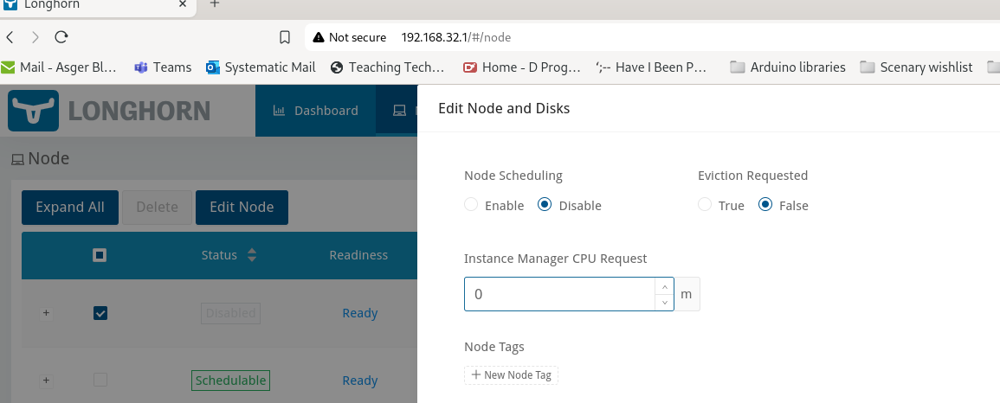

Longhorn Storage system
===============================

Longhorn is a storage manager for kubernetes, based around local storage on the nodes.
In that, it is somewhat like Hadoop, which is also designed for machines with both processing and storage.

Preparing for Longhorn
-----------------------------
https://longhorn.io/docs/1.7.2/deploy/install/#using-the-environment-check-script
Firstly, Longhorn have provides a script to check if your system meets the requirements. So let us try to run this

```
[aabl@k8smaster1 ~]$ curl -sSfL https://raw.githubusercontent.com/longhorn/longhorn/v1.7.2/scripts/environment_check.sh | bash
[INFO]  Required dependencies 'kubectl jq mktemp sort printf' are installed.
[INFO]  All nodes have unique hostnames.
[INFO]  Waiting for longhorn-environment-check pods to become ready (0/3)...
[INFO]  Waiting for longhorn-environment-check pods to become ready (0/3)...
[INFO]  All longhorn-environment-check pods are ready (3/3).
[INFO]  MountPropagation is enabled
[INFO]  Checking kernel release...
[INFO]  Checking iscsid...
[ERROR] kernel module iscsi_tcp is not enabled on k8snode2.k8s.askov.net
[ERROR] Neither iscsid.service nor iscsid.socket is running on k8smaster1.k8s.askov.net
[ERROR] kernel module iscsi_tcp is not enabled on k8snode1.k8s.askov.net
[INFO]  Checking multipathd...
[INFO]  Checking packages...
[ERROR] nfs-utils is not found in k8snode2.k8s.askov.net.
[ERROR] nfs-utils is not found in k8smaster1.k8s.askov.net.
[ERROR] nfs-utils is not found in k8snode1.k8s.askov.net.
[INFO]  Checking nfs client...
[INFO]  Cleaning up longhorn-environment-check pods...
[INFO]  Cleanup completed.
[aabl@k8smaster1 ~]$ 
```

So we lack the kernel module `iscsi_tcp` and the tool `nfs-utils`. 

Lets install the `nfs-util` tool

```
[aabl@k8smaster1 ~]$ sudo dnf install nfs-utils
Last metadata expiration check: 0:10:50 ago on Sat Nov  2 12:22:14 2024.
Dependencies resolved.
===================================================================================================================================================================================================================================
 Package                                                   Architecture                                      Version                                                       Repository                                         Size
===================================================================================================================================================================================================================================
Installing:
 nfs-utils                                                 x86_64                                            1:2.5.4-26.el9_4                                              baseos                                            429 k
Installing dependencies:
 gssproxy                                                  x86_64                                            0.8.4-6.el9                                                   baseos                                            108 k
 keyutils                                                  x86_64                                            1.6.3-1.el9                                                   baseos                                             72 k
 libev                                                     x86_64                                            4.33-5.el9                                                    baseos                                             52 k
 libnfsidmap                                               x86_64                                            1:2.5.4-26.el9_4                                              baseos                                             59 k
 libverto-libev                                            x86_64                                            0.3.2-3.el9                                                   baseos                                             13 k
 rpcbind                                                   x86_64                                            1.2.6-7.el9                                                   baseos                                             56 k
 sssd-nfs-idmap                                            x86_64                                            2.9.4-6.el9_4.1                                               baseos                                             41 k

Transaction Summary
===================================================================================================================================================================================================================================
Install  8 Packages

Total download size: 830 k
Installed size: 2.1 M
Is this ok [y/N]: y
Downloading Packages:
(1/8): libverto-libev-0.3.2-3.el9.x86_64.rpm                                                                                                                                                        91 kB/s |  13 kB     00:00    
(2/8): rpcbind-1.2.6-7.el9.x86_64.rpm                                                                                                                                                              367 kB/s |  56 kB     00:00    
(3/8): libev-4.33-5.el9.x86_64.rpm                                                                                                                                                                 323 kB/s |  52 kB     00:00    
(4/8): sssd-nfs-idmap-2.9.4-6.el9_4.1.x86_64.rpm                                                                                                                                                   969 kB/s |  41 kB     00:00    
(5/8): gssproxy-0.8.4-6.el9.x86_64.rpm                                                                                                                                                             2.3 MB/s | 108 kB     00:00    
(6/8): nfs-utils-2.5.4-26.el9_4.x86_64.rpm                                                                                                                                                         6.2 MB/s | 429 kB     00:00    
(7/8): libnfsidmap-2.5.4-26.el9_4.x86_64.rpm                                                                                                                                                       1.2 MB/s |  59 kB     00:00    
(8/8): keyutils-1.6.3-1.el9.x86_64.rpm                                                                                                                                                             1.8 MB/s |  72 kB     00:00    
-----------------------------------------------------------------------------------------------------------------------------------------------------------------------------------------------------------------------------------
Total                                                                                                                                                                                              1.7 MB/s | 830 kB     00:00     
Running transaction check
Transaction check succeeded.
Running transaction test
Transaction test succeeded.
Running transaction
  Preparing        :                                                                                                                                                                                                           1/1 
  Installing       : libnfsidmap-1:2.5.4-26.el9_4.x86_64                                                                                                                                                                       1/8 
  Installing       : keyutils-1.6.3-1.el9.x86_64                                                                                                                                                                               2/8 
  Installing       : libev-4.33-5.el9.x86_64                                                                                                                                                                                   3/8 
  Installing       : libverto-libev-0.3.2-3.el9.x86_64                                                                                                                                                                         4/8 
  Installing       : gssproxy-0.8.4-6.el9.x86_64                                                                                                                                                                               5/8 
  Running scriptlet: gssproxy-0.8.4-6.el9.x86_64                                                                                                                                                                               5/8 
  Running scriptlet: rpcbind-1.2.6-7.el9.x86_64                                                                                                                                                                                6/8 
  Installing       : rpcbind-1.2.6-7.el9.x86_64                                                                                                                                                                                6/8 
  Running scriptlet: rpcbind-1.2.6-7.el9.x86_64                                                                                                                                                                                6/8 
Created symlink /etc/systemd/system/multi-user.target.wants/rpcbind.service → /usr/lib/systemd/system/rpcbind.service.
Created symlink /etc/systemd/system/sockets.target.wants/rpcbind.socket → /usr/lib/systemd/system/rpcbind.socket.

  Running scriptlet: nfs-utils-1:2.5.4-26.el9_4.x86_64                                                                                                                                                                         7/8 
  Installing       : nfs-utils-1:2.5.4-26.el9_4.x86_64                                                                                                                                                                         7/8 
  Running scriptlet: nfs-utils-1:2.5.4-26.el9_4.x86_64                                                                                                                                                                         7/8 
  Installing       : sssd-nfs-idmap-2.9.4-6.el9_4.1.x86_64                                                                                                                                                                     8/8 
  Running scriptlet: sssd-nfs-idmap-2.9.4-6.el9_4.1.x86_64                                                                                                                                                                     8/8 
  Verifying        : libverto-libev-0.3.2-3.el9.x86_64                                                                                                                                                                         1/8 
  Verifying        : rpcbind-1.2.6-7.el9.x86_64                                                                                                                                                                                2/8 
  Verifying        : libev-4.33-5.el9.x86_64                                                                                                                                                                                   3/8 
  Verifying        : sssd-nfs-idmap-2.9.4-6.el9_4.1.x86_64                                                                                                                                                                     4/8 
  Verifying        : gssproxy-0.8.4-6.el9.x86_64                                                                                                                                                                               5/8 
  Verifying        : nfs-utils-1:2.5.4-26.el9_4.x86_64                                                                                                                                                                         6/8 
  Verifying        : libnfsidmap-1:2.5.4-26.el9_4.x86_64                                                                                                                                                                       7/8 
  Verifying        : keyutils-1.6.3-1.el9.x86_64                                                                                                                                                                               8/8 

Installed:
  gssproxy-0.8.4-6.el9.x86_64           keyutils-1.6.3-1.el9.x86_64 libev-4.33-5.el9.x86_64 libnfsidmap-1:2.5.4-26.el9_4.x86_64 libverto-libev-0.3.2-3.el9.x86_64 nfs-utils-1:2.5.4-26.el9_4.x86_64 rpcbind-1.2.6-7.el9.x86_64
  sssd-nfs-idmap-2.9.4-6.el9_4.1.x86_64

Complete!
[aabl@k8smaster1 ~]$ 
```

And we are now missing `iscsi-initiator-utils`

```
[aabl@k8smaster1 ~]$ curl -sSfL https://raw.githubusercontent.com/longhorn/longhorn/v1.7.2/scripts/environment_check.sh | bash
[INFO]  Required dependencies 'kubectl jq mktemp sort printf' are installed.
[INFO]  All nodes have unique hostnames.
[INFO]  Waiting for longhorn-environment-check pods to become ready (0/3)...
[INFO]  All longhorn-environment-check pods are ready (3/3).
[INFO]  MountPropagation is enabled
[INFO]  Checking kernel release...
[INFO]  Checking iscsid...
E1102 12:33:17.729236   44731 websocket.go:296] Unknown stream id 1, discarding message
[ERROR] kernel module iscsi_tcp is not enabled on k8snode2.k8s.askov.net
[ERROR] Neither iscsid.service nor iscsid.socket is running on k8smaster1.k8s.askov.net
[ERROR] kernel module iscsi_tcp is not enabled on k8snode1.k8s.askov.net
[INFO]  Checking multipathd...
[INFO]  Checking packages...
[ERROR] nfs-utils is not found in k8snode2.k8s.askov.net.
[ERROR] iscsi-initiator-utils is not found in k8smaster1.k8s.askov.net.
[ERROR] nfs-utils is not found in k8snode1.k8s.askov.net.
[INFO]  Checking nfs client...
[INFO]  Cleaning up longhorn-environment-check pods...
[INFO]  Cleanup completed.
[aabl@k8smaster1 ~]$ 
```

So we install that.

```
[aabl@k8smaster1 ~]$ sudo dnf install iscsi-initiator-utils
Last metadata expiration check: 0:12:51 ago on Sat Nov  2 12:22:14 2024.
Dependencies resolved.
===================================================================================================================================================================================================================================
 Package                                                             Architecture                                Version                                                         Repository                                   Size
===================================================================================================================================================================================================================================
Installing:
 iscsi-initiator-utils                                               x86_64                                      6.2.1.9-1.gita65a472.el9                                        baseos                                      383 k
Installing dependencies:
 iscsi-initiator-utils-iscsiuio                                      x86_64                                      6.2.1.9-1.gita65a472.el9                                        baseos                                       80 k
 isns-utils-libs                                                     x86_64                                      0.101-4.el9                                                     baseos                                      100 k

Transaction Summary
===================================================================================================================================================================================================================================
Install  3 Packages

Total download size: 563 k
Installed size: 2.1 M
Is this ok [y/N]: y
Downloading Packages:
(1/3): iscsi-initiator-utils-iscsiuio-6.2.1.9-1.gita65a472.el9.x86_64.rpm                                                                                                                          363 kB/s |  80 kB     00:00    
(2/3): isns-utils-libs-0.101-4.el9.x86_64.rpm                                                                                                                                                      446 kB/s | 100 kB     00:00    
(3/3): iscsi-initiator-utils-6.2.1.9-1.gita65a472.el9.x86_64.rpm                                                                                                                                   1.4 MB/s | 383 kB     00:00    
-----------------------------------------------------------------------------------------------------------------------------------------------------------------------------------------------------------------------------------
Total                                                                                                                                                                                              1.1 MB/s | 563 kB     00:00     
Running transaction check
Transaction check succeeded.
Running transaction test
Transaction test succeeded.
Running transaction
  Preparing        :                                                                                                                                                                                                           1/1 
  Installing       : isns-utils-libs-0.101-4.el9.x86_64                                                                                                                                                                        1/3 
  Installing       : iscsi-initiator-utils-iscsiuio-6.2.1.9-1.gita65a472.el9.x86_64                                                                                                                                            2/3 
  Running scriptlet: iscsi-initiator-utils-iscsiuio-6.2.1.9-1.gita65a472.el9.x86_64                                                                                                                                            2/3 
Created symlink /etc/systemd/system/sockets.target.wants/iscsiuio.socket → /usr/lib/systemd/system/iscsiuio.socket.

  Installing       : iscsi-initiator-utils-6.2.1.9-1.gita65a472.el9.x86_64                                                                                                                                                     3/3 
  Running scriptlet: iscsi-initiator-utils-6.2.1.9-1.gita65a472.el9.x86_64                                                                                                                                                     3/3 
Created symlink /etc/systemd/system/sysinit.target.wants/iscsi-starter.service → /usr/lib/systemd/system/iscsi-starter.service.
Created symlink /etc/systemd/system/sockets.target.wants/iscsid.socket → /usr/lib/systemd/system/iscsid.socket.
Created symlink /etc/systemd/system/sysinit.target.wants/iscsi-onboot.service → /usr/lib/systemd/system/iscsi-onboot.service.

  Verifying        : isns-utils-libs-0.101-4.el9.x86_64                                                                                                                                                                        1/3 
  Verifying        : iscsi-initiator-utils-iscsiuio-6.2.1.9-1.gita65a472.el9.x86_64                                                                                                                                            2/3 
  Verifying        : iscsi-initiator-utils-6.2.1.9-1.gita65a472.el9.x86_64                                                                                                                                                     3/3 

Installed:
  iscsi-initiator-utils-6.2.1.9-1.gita65a472.el9.x86_64                         iscsi-initiator-utils-iscsiuio-6.2.1.9-1.gita65a472.el9.x86_64                         isns-utils-libs-0.101-4.el9.x86_64                        

Complete!
[aabl@k8smaster1 ~]$ curl -sSfL https://raw.githubusercontent.com/longhorn/longhorn/v1.7.2/scripts/environment_check.sh | bash
[INFO]  Required dependencies 'kubectl jq mktemp sort printf' are installed.
[INFO]  All nodes have unique hostnames.
[INFO]  Waiting for longhorn-environment-check pods to become ready (0/3)...
[INFO]  All longhorn-environment-check pods are ready (3/3).
[INFO]  MountPropagation is enabled
[INFO]  Checking kernel release...
[INFO]  Checking iscsid...
[ERROR] Neither iscsid.service nor iscsid.socket is running on k8smaster1.k8s.askov.net
[ERROR] kernel module iscsi_tcp is not enabled on k8snode2.k8s.askov.net
[ERROR] kernel module iscsi_tcp is not enabled on k8snode1.k8s.askov.net
[INFO]  Checking multipathd...
[INFO]  Checking packages...
[ERROR] nfs-utils is not found in k8snode2.k8s.askov.net.
[ERROR] nfs-utils is not found in k8snode1.k8s.askov.net.
[INFO]  Checking nfs client...
[INFO]  Cleaning up longhorn-environment-check pods...
[INFO]  Cleanup completed.
[aabl@k8smaster1 ~]$ 
```

Then the `iscsid.service` needs to be started

```
[aabl@k8smaster1 ~]$ sudo systemctl enable iscsid.service --now
Created symlink /etc/systemd/system/multi-user.target.wants/iscsid.service → /usr/lib/systemd/system/iscsid.service.
[aabl@k8smaster1 ~]$ 
```

```
[aabl@k8smaster1 ~]$ sudo modprobe iscsi_tcp
[aabl@k8smaster1 ~]$ curl -sSfL https://raw.githubusercontent.com/longhorn/longhorn/v1.7.2/scripts/environment_check.sh | bash
[INFO]  Required dependencies 'kubectl jq mktemp sort printf' are installed.
[INFO]  All nodes have unique hostnames.
[INFO]  Waiting for longhorn-environment-check pods to become ready (0/3)...
[INFO]  All longhorn-environment-check pods are ready (3/3).
[INFO]  MountPropagation is enabled
[INFO]  Checking kernel release...
[INFO]  Checking iscsid...
[ERROR] kernel module iscsi_tcp is not enabled on k8snode2.k8s.askov.net
[ERROR] kernel module iscsi_tcp is not enabled on k8snode1.k8s.askov.net
[INFO]  Checking multipathd...
[INFO]  Checking packages...
[ERROR] nfs-utils is not found in k8snode2.k8s.askov.net.
[ERROR] nfs-utils is not found in k8snode1.k8s.askov.net.
[INFO]  Checking nfs client...
[INFO]  Cleaning up longhorn-environment-check pods...
[INFO]  Cleanup completed.
[aabl@k8smaster1 ~]$
```
So this takes care of the kernel module.
Let's make the change permanent
```
[aabl@k8smaster1 ~]$ echo "iscsi_tcp" | sudo tee /etc/modules-load.d/longhorn.conf
iscsi_tcp
[aabl@k8smaster1 ~]$ sudo systemctl restart systemd-modules-load.service 
[aabl@k8smaster1 ~]$ sudo systemctl status systemd-modules-load.service 
● systemd-modules-load.service - Load Kernel Modules
     Loaded: loaded (/usr/lib/systemd/system/systemd-modules-load.service; static)
     Active: active (exited) since Sat 2024-11-02 12:51:30 CET; 1s ago
       Docs: man:systemd-modules-load.service(8)
             man:modules-load.d(5)
    Process: 5565 ExecStart=/usr/lib/systemd/systemd-modules-load (code=exited, status=0/SUCCESS)
   Main PID: 5565 (code=exited, status=0/SUCCESS)
        CPU: 15ms

Nov 02 12:51:30 k8smaster1.k8s.askov.net systemd[1]: Stopped Load Kernel Modules.
Nov 02 12:51:30 k8smaster1.k8s.askov.net systemd[1]: Stopping Load Kernel Modules...
Nov 02 12:51:30 k8smaster1.k8s.askov.net systemd[1]: Starting Load Kernel Modules...
Nov 02 12:51:30 k8smaster1.k8s.askov.net systemd-modules-load[5565]: Inserted module 'iscsi_tcp'
Nov 02 12:51:30 k8smaster1.k8s.askov.net systemd[1]: Finished Load Kernel Modules.
[aabl@k8smaster1 modules-load.d]$ 
```

And the last test

```
[aabl@k8smaster1 ~]$ curl -sSfL https://raw.githubusercontent.com/longhorn/longhorn/v1.7.2/scripts/environment_check.sh | bash
[INFO]  Required dependencies 'kubectl jq mktemp sort printf' are installed.
[INFO]  All nodes have unique hostnames.
[INFO]  Waiting for longhorn-environment-check pods to become ready (0/3)...
[INFO]  All longhorn-environment-check pods are ready (3/3).
[INFO]  MountPropagation is enabled
[INFO]  Checking kernel release...
[INFO]  Checking iscsid...
[ERROR] kernel module iscsi_tcp is not enabled on k8snode2.k8s.askov.net
[ERROR] kernel module iscsi_tcp is not enabled on k8snode1.k8s.askov.net
[INFO]  Checking multipathd...
[INFO]  Checking packages...
[ERROR] nfs-utils is not found in k8snode2.k8s.askov.net.
[ERROR] nfs-utils is not found in k8snode1.k8s.askov.net.
[INFO]  Checking nfs client...
[INFO]  Cleaning up longhorn-environment-check pods...
[INFO]  Cleanup completed.
[aabl@k8smaster1 ~]$ 
```

So, to summarize, we need to do these things

```
sudo dnf install -y nfs-utils iscsi-initiator-utils
sudo systemctl enable iscsid.service --now
echo "iscsi_tcp" | sudo tee /etc/modules-load.d/longhorn.conf
sudo systemctl restart systemd-modules-load.service 
```

And the check is now green

```
[aabl@k8smaster1 ~]$ curl -sSfL https://raw.githubusercontent.com/longhorn/longhorn/v1.7.2/scripts/environment_check.sh | bash
[INFO]  Required dependencies 'kubectl jq mktemp sort printf' are installed.
[INFO]  All nodes have unique hostnames.
[INFO]  Waiting for longhorn-environment-check pods to become ready (0/3)...
[INFO]  All longhorn-environment-check pods are ready (3/3).
[INFO]  MountPropagation is enabled
[INFO]  Checking kernel release...
[INFO]  Checking iscsid...
[INFO]  Checking multipathd...
[INFO]  Checking packages...
[INFO]  Checking nfs client...
[INFO]  Cleaning up longhorn-environment-check pods...
[INFO]  Cleanup completed.
[aabl@k8smaster1 ~]$ 
```

Preparing LVM
----------------

Longhorn does not support sharding, i.e. having one virtual drive span multiple drives.
As I have multiple 1TB M.2 drives, I need to combine them to a common file system, if I want to be able to
make Volumes bigger than 1TB.

LVM seems like the right choice for this.

The disks we have to work with
```
[root@k8snode2 ~]# lsblk
NAME                 MAJ:MIN RM   SIZE RO TYPE MOUNTPOINTS
nvme4n1              259:0    0 931.5G  0 disk 
nvme3n1              259:1    0 931.5G  0 disk 
├─nvme3n1p1          259:6    0   600M  0 part /boot/efi
├─nvme3n1p2          259:7    0     1G  0 part /boot
└─nvme3n1p3          259:8    0 929.9G  0 part 
  └─rl_k8snode2-root 253:0    0 929.9G  0 lvm  /
nvme5n1              259:2    0 931.5G  0 disk 
nvme1n1              259:3    0 931.5G  0 disk 
nvme2n1              259:4    0 931.5G  0 disk 
nvme0n1              259:5    0 931.5G  0 disk 
[root@k8snode2 ~]# 
```

So let us create the physical volumes
```
[root@k8snode2 ~]# pvcreate /dev/nvme0n1 
  Physical volume "/dev/nvme0n1" successfully created.
[root@k8snode2 ~]# pvcreate /dev/nvme1n1 
  Physical volume "/dev/nvme1n1" successfully created.
[root@k8snode2 ~]# pvcreate /dev/nvme4n1 
  Physical volume "/dev/nvme4n1" successfully created.
[root@k8snode2 ~]# pvcreate /dev/nvme5n1 
  Physical volume "/dev/nvme5n1" successfully created.
[root@k8snode2 ~]#
```

We skip the `nvme2n1` disk, as I have other plans for that one.

Then we create the volume group

```
[root@k8snode2 ~]# vgcreate vg_k8s /dev/nvme0n1 /dev/nvme1n1 /dev/nvme4n1 /dev/nvme5n1 
  Volume group "vg_k8s" successfully created
[root@k8snode2 ~]# 
```

And then we can create the logical volume
```
[root@k8snode2 ~]# lvcreate --type raid5 --stripes 3 --extents 100%FREE  vg_k8s --name longhorn 
```

Let us see what we have created
```
[root@k8snode2 ~]# lvdisplay vg_k8s
  --- Logical volume ---
  LV Path                /dev/vg_k8s/longhorn
  LV Name                longhorn
  VG Name                vg_k8s
  LV UUID                Z5KtkL-ak40-8xIz-iZdP-Nsrg-v5Wv-dz30hs
  LV Write Access        read/write
  LV Creation host, time k8snode2.k8s.askov.net, 2024-11-02 14:11:32 +0100
  LV Status              available
  # open                 0
  LV Size                <2.73 TiB
  Current LE             715398
  Segments               1
  Allocation             inherit
  Read ahead sectors     auto
  - currently set to     8192
  Block device           253:9
   
[root@k8snode2 ~]# 
```

And let us then mount it

```
echo '/dev/vg_k8s/longhorn     /longhorn   ext4    defaults    0   2' | sudo tee -a /etc/fstab
sudo systemctl daemon-reload
sudo mkdir -p /longhorn
sudo mount -a
```


Installing Longhorn
------------------------------

https://longhorn.io/docs/1.7.2/deploy/install/install-with-kubectl/

```
aabl@fedora:~$ kubectl apply -f https://raw.githubusercontent.com/longhorn/longhorn/v1.7.2/deploy/longhorn.yaml
namespace/longhorn-system created
priorityclass.scheduling.k8s.io/longhorn-critical created
serviceaccount/longhorn-service-account created
serviceaccount/longhorn-ui-service-account created
serviceaccount/longhorn-support-bundle created
configmap/longhorn-default-setting created
configmap/longhorn-storageclass created
customresourcedefinition.apiextensions.k8s.io/backingimagedatasources.longhorn.io created
customresourcedefinition.apiextensions.k8s.io/backingimagemanagers.longhorn.io created
customresourcedefinition.apiextensions.k8s.io/backingimages.longhorn.io created
customresourcedefinition.apiextensions.k8s.io/backupbackingimages.longhorn.io created
customresourcedefinition.apiextensions.k8s.io/backups.longhorn.io created
customresourcedefinition.apiextensions.k8s.io/backuptargets.longhorn.io created
customresourcedefinition.apiextensions.k8s.io/backupvolumes.longhorn.io created
customresourcedefinition.apiextensions.k8s.io/engineimages.longhorn.io created
customresourcedefinition.apiextensions.k8s.io/engines.longhorn.io created
customresourcedefinition.apiextensions.k8s.io/instancemanagers.longhorn.io created
customresourcedefinition.apiextensions.k8s.io/nodes.longhorn.io created
customresourcedefinition.apiextensions.k8s.io/orphans.longhorn.io created
customresourcedefinition.apiextensions.k8s.io/recurringjobs.longhorn.io created
customresourcedefinition.apiextensions.k8s.io/replicas.longhorn.io created
customresourcedefinition.apiextensions.k8s.io/settings.longhorn.io created
customresourcedefinition.apiextensions.k8s.io/sharemanagers.longhorn.io created
customresourcedefinition.apiextensions.k8s.io/snapshots.longhorn.io created
customresourcedefinition.apiextensions.k8s.io/supportbundles.longhorn.io created
customresourcedefinition.apiextensions.k8s.io/systembackups.longhorn.io created
customresourcedefinition.apiextensions.k8s.io/systemrestores.longhorn.io created
customresourcedefinition.apiextensions.k8s.io/volumeattachments.longhorn.io created
customresourcedefinition.apiextensions.k8s.io/volumes.longhorn.io created
clusterrole.rbac.authorization.k8s.io/longhorn-role created
clusterrolebinding.rbac.authorization.k8s.io/longhorn-bind created
clusterrolebinding.rbac.authorization.k8s.io/longhorn-support-bundle created
service/longhorn-backend created
service/longhorn-frontend created
service/longhorn-conversion-webhook created
service/longhorn-admission-webhook created
service/longhorn-recovery-backend created
daemonset.apps/longhorn-manager created
deployment.apps/longhorn-driver-deployer created
deployment.apps/longhorn-ui created
aabl@fedora:~$ 
```

And we can then check the progress of the install and startup with
```

```

When the installation is ready, we can expose the `longhorn-ui` and check out the system

```
kubectl expose -n longhorn-system deployment longhorn-ui --port 80 --target-port http --type LoadBalancer
```


Setup Longhorn
--------------------


The first thing to do is to ensure that storage is not requested on `k8smaster1`



And then we must set up the nodes with the correct storage config


I found that the longhorn ui settings do not always translate correctly to the storage class, so we will have to set these by hand

```
aabl@fedora:~$ kubectl edit -n longhorn-system configmaps longhorn-storageclass 
```
We change the `numberOfReplicas` to 2 (from 3), as we only have 2 storage nodes.
We also set `dataLocality` to `best-effort`
```yaml
apiVersion: v1
data:
  storageclass.yaml: |
    kind: StorageClass
    apiVersion: storage.k8s.io/v1
    metadata:
      name: longhorn
      annotations:
        storageclass.kubernetes.io/is-default-class: "true"
    provisioner: driver.longhorn.io
    allowVolumeExpansion: true
    reclaimPolicy: "Delete"
    volumeBindingMode: Immediate
    parameters:
      numberOfReplicas: "2"
      staleReplicaTimeout: "30"
      fromBackup: ""
      fsType: "ext4"
      dataLocality: "best-effort"
      unmapMarkSnapChainRemoved: "ignored"
      disableRevisionCounter: "true"
      dataEngine: "v1"
```

Testing Longhorn
---------------------

We can create a simple pod with a Persistent Volume Claim with this command
```
kubectl create -f https://raw.githubusercontent.com/longhorn/longhorn/v1.7.2/examples/pod_with_pvc.yaml
```

We will see that a Persistent Volume of 2 GB is created and mounted. 
If we "enter" the pod and create something on the volume, is will remain.
Check this by deleting the pod and recreating it.
