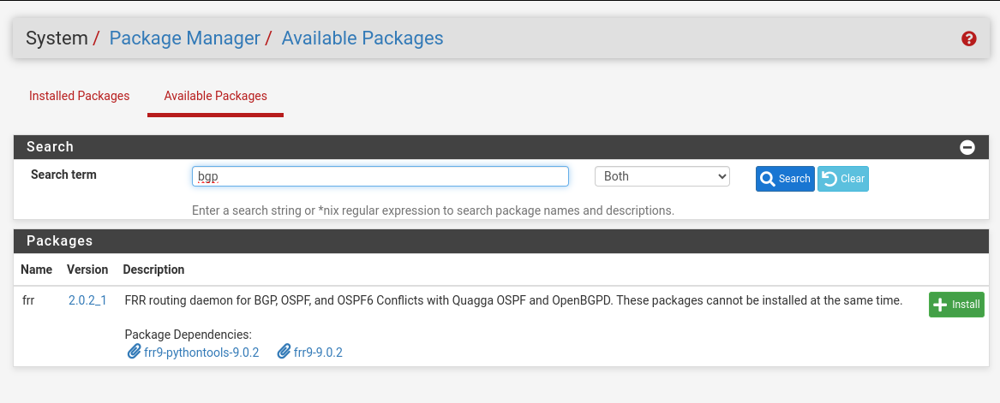
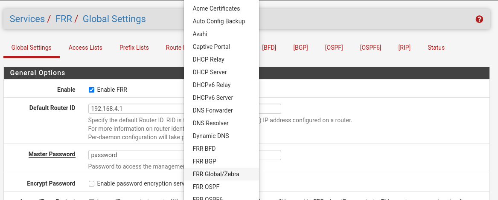
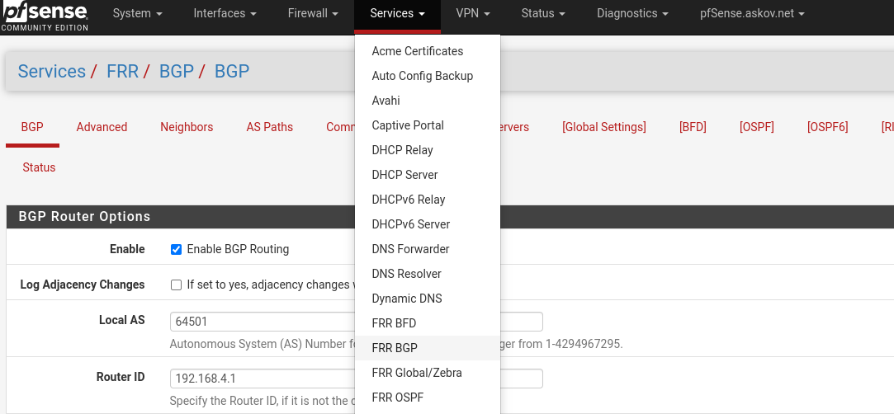
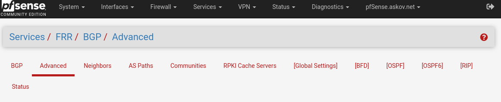
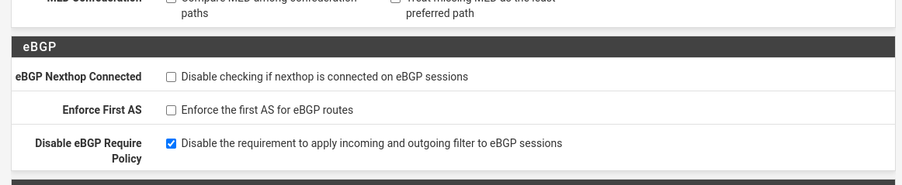
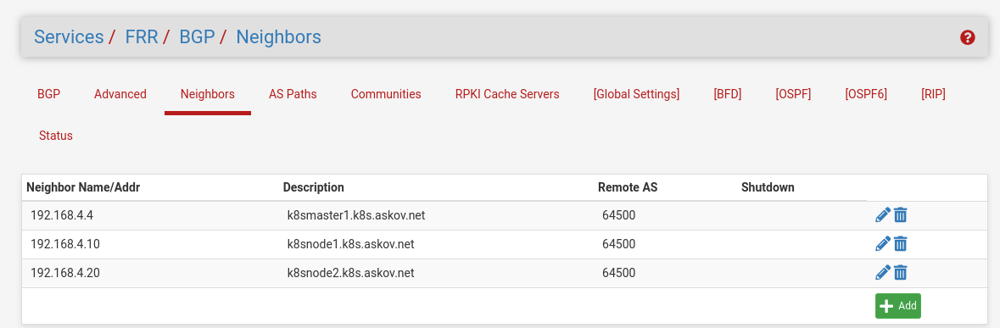
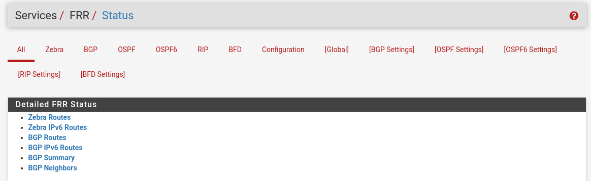

#### MetalLB
[MetalLB](https://metallb.universe.tf/) is our Load balancer of choice.

A load-balancer handles the assignment and resolution of externally reachable IP-addresses to Kubernetes Services.

For now, we just install MetalLB with the simplest possible command
```
kubectl apply -f https://raw.githubusercontent.com/metallb/metallb/v0.15.2/config/manifests/metallb-native.yaml

helm install prometheus-operator-crds prometheus-community/prometheus-operator-crds --namespace monitoring

kubectl apply -f https://raw.githubusercontent.com/metallb/metallb/v0.15.2/config/manifests/metallb-native-prometheus.yaml
```

We have chosen MetalLB because it can use the [Border Gateway Protocol](https://en.wikipedia.org/wiki/Border_Gateway_Protocol) to communicate with PFSense.
See, the problem we are facing is that all external traffic is routed through PFSense. When a Load Balancer assigns an "external" IP to a service, then this IP is only external as far as the cluster is concerned. I.e. from any of the cluster nodes, you will be able to access this IP. But if we want systems that are not part of the Kubernetes cluster to resolve this IP, we need to tell PFSense that this IP is now part of the cluster.

To solve this problem, we need the Border Gateway Protocol, as this was designed exactly for routers to communicate about which IPs are reachable through which routers.


MetalLB is now installed, so it is time to configure it.
MetalLB is configured through CRDs, i.e. Custom Resource Definitions.

Here, we will follow the [official documentation](https://metallb.universe.tf/configuration/): 


### Ip Address Pool

First we must tell MetalLB which range of IP addresses it can use.
We can do this by creating an `IPAddressPool`, which  represents a pool of IP addresses that can be allocated to LoadBalancer services.

Here we define the pool `192.168.32.0/24`. It is important that we do not pick a pool that includes already included IP addresses, such as `192.168.4.0/24`, as the Load Balancer will not check if an IP address is already in use.

```yaml
apiVersion: metallb.io/v1beta1
kind: IPAddressPool
metadata:
  name: metallb-pool
  namespace: metallb-system
spec:
  addresses:
    - 192.168.32.0/24
```

### BGP Advertisement

Now we must tell MetalLB how to advertise it's allocated IPs to PFSense. We do this by creating a BGP Advertisement Custom Resource

```yaml
apiVersion: metallb.io/v1beta1
kind: BGPAdvertisement
metadata:
  name: metallb-advertisment
  namespace: metallb-system
spec:
  ipAddressPools:
    - metallb-pool # Reference to the IP Address Pool above
  localPref: 100 # Weight of the routes we advertise
  communities:
    - 65535:65282 # no-advertise community
```
The no-advertise community means that the peer router(s) is informed  that they can use this route, but they shouldn’t tell anyone else about it.

 
### BGP Peer

And finally, we need to configure MetalLB to send the advertisement to PFSense. We do this with a BGP Peer Custom Resource.

If you have multiple firewalls, you would need a BGP Peer CR for each firewall.

```yaml
apiVersion: metallb.io/v1beta2
kind: BGPPeer
metadata:
  name: metallb-bgppeer-pfsense
  namespace: metallb-system
spec:
  myASN: 64500
  peerASN: 64501
  peerAddress: 192.168.4.1 # PFSense address
```

Here you have to pick two numbers, `myASN` and `peerASN`.

ASN numbers are IDs of systems in BGP. So we pick the ID of MetalLB/The Kubernetes cluster to be `64500` and the ID of PFSense to be `64501`

PFSense
=========================

This section is heavily indepted to https://geek-cookbook.funkypenguin.co.nz/kubernetes/loadbalancer/metallb/pfsense/

First we need to install the FRR package on PFSense, as it does not come with the BGP functionality per default



### Configure FRR Global/Zebra
After the package have been installed, we must enable it (**Services -> FRR Global/Zebra**) and set our `default router id`. This must match the `peerAddress` we used in the BGP Peer CR, i.e. `192.168.4.1`

Apparently we also must set a password, but nothing will use this password. So just pick something to make the system happy.


### Configure FRR BGP

Now we must set up the Border Gateway Protocol routing (**Services -> FRR BGP**). We assign the pre-selected ASN (`64501`) as well as the Router ID


### Configure FRR BGP Advanced
(FIXME: Why???) Then we must disable something





### BGP Neighbour
Now we must create a neighbour object for each kubernetes node. In our case, this means `k8smaster1`, `k8snode1` and `k8snode2`.



Each of these must be configured with the preselected MetalLB ASN (`64500`) and not much else.


## Applying the settings
First, we create a Loadbalancer service, to in order to be able to test
```
[aabl@k8smaster1 ~]$ kubectl expose deployment test --type LoadBalancer
service/test exposed
[aabl@k8smaster1 ~]$ kubectl get service
NAME         TYPE           CLUSTER-IP      EXTERNAL-IP   PORT(S)        AGE
kubernetes   ClusterIP      10.43.0.1       <none>        443/TCP        7d18h
test         LoadBalancer   10.43.129.111   <pending>     80:32449/TCP   5s
[aabl@k8smaster1 ~]$ 
```
As we can see, the external IP is stuck as pending, as MetalLB is not configured and can thus not give us an IP.

So we configure it with the config from above:
```
[aabl@k8smaster1 ~]$ kubectl apply -f ipaddresspool.yaml 
ipaddresspool.metallb.io/metallb-pool created
[aabl@k8smaster1 ~]$ kubectl apply -f BGPAdvertisement.yaml 
bgpadvertisement.metallb.io/metallb-advertisment created
[aabl@k8smaster1 ~]$ kubectl apply -f bgppeer.yaml 
bgppeer.metallb.io/metallb-bgppeer-pfsense created
[aabl@k8smaster1 ~]$
```

Now MetalLB kicks into action and assigns an IP (from our `ipaddresspool`) to the service
```
[aabl@k8smaster1 ~]$ kubectl get service
NAME         TYPE           CLUSTER-IP      EXTERNAL-IP    PORT(S)        AGE
kubernetes   ClusterIP      10.43.0.1       <none>         443/TCP        7d19h
test         LoadBalancer   10.43.129.111   192.168.32.1   80:32449/TCP   45m
[aabl@k8smaster1 ~]$ 
```

And this IP is globally routed by PFSense, as I can reach it from my workstation (ref my [Janky Network](PFSense%20K8S%20Network.md))
```
aabl@fedora:~$ curl 192.168.32.1
<!DOCTYPE html>
<html>
<head>
<title>Welcome to nginx!</title>
<style>
html { color-scheme: light dark; }
body { width: 35em; margin: 0 auto;
font-family: Tahoma, Verdana, Arial, sans-serif; }
</style>
</head>
<body>
<h1>Welcome to nginx!</h1>
<p>If you see this page, the nginx web server is successfully installed and
working. Further configuration is required.</p>

<p>For online documentation and support please refer to
<a href="http://nginx.org/">nginx.org</a>.<br/>
Commercial support is available at
<a href="http://nginx.com/">nginx.com</a>.</p>

<p><em>Thank you for using nginx.</em></p>
</body>
</html>
aabl@fedora:~$ 
```

We can see the status on PFSense 


Zebra Routes
```
Codes: K - kernel route, C - connected, S - static, R - RIP,
       O - OSPF, I - IS-IS, B - BGP, E - EIGRP, T - Table,
       v - VNC, V - VNC-Direct, A - Babel, f - OpenFabric,
       > - selected route, * - FIB route, q - queued, r - rejected, b - backup
       t - trapped, o - offload failure

K>* 0.0.0.0/0 [0/0] via 87.49.255.193, vtnet2, 5d17h46m
C>* 87.49.255.192/26 [0/1] is directly connected, vtnet2, 5d17h46m
C>* 192.168.2.0/24 [0/1] is directly connected, vtnet0, 5d17h46m
C>* 192.168.3.0/24 [0/1] is directly connected, vtnet3, 5d17h46m
C>* 192.168.4.0/24 [0/1] is directly connected, vtnet1, 5d17h46m
B>* 192.168.32.0/32 [20/0] via 192.168.4.4, vtnet1, weight 1, 00:03:23
  *                        via 192.168.4.10, vtnet1, weight 1, 00:03:23
  *                        via 192.168.4.20, vtnet1, weight 1, 00:03:23
B>* 192.168.32.1/32 [20/0] via 192.168.4.4, vtnet1, weight 1, 00:03:23
  *                        via 192.168.4.10, vtnet1, weight 1, 00:03:23
  *                        via 192.168.4.20, vtnet1, weight 1, 00:03:23
```

BGP Routes
```
BGP table version is 2, local router ID is 192.168.4.1, vrf id 0
Default local pref 100, local AS 64501
Status codes:  s suppressed, d damped, h history, * valid, > best, = multipath,
               i internal, r RIB-failure, S Stale, R Removed
Nexthop codes: @NNN nexthop's vrf id, < announce-nh-self
Origin codes:  i - IGP, e - EGP, ? - incomplete
RPKI validation codes: V valid, I invalid, N Not found

    Network          Next Hop            Metric LocPrf Weight Path
 *= 192.168.32.0/32  192.168.4.20                           0 64500 i
 *=                  192.168.4.10                           0 64500 i
 *>                  192.168.4.4                            0 64500 i
 *= 192.168.32.1/32  192.168.4.20                           0 64500 i
 *=                  192.168.4.10                           0 64500 i
 *>                  192.168.4.4                            0 64500 i

Displayed  2 routes and 6 total paths
```

BGP Summary
```
IPv4 Unicast Summary (VRF default):
BGP router identifier 192.168.4.1, local AS number 64501 vrf-id 0
BGP table version 2
RIB entries 3, using 576 bytes of memory
Peers 3, using 40 KiB of memory

Neighbor        V         AS   MsgRcvd   MsgSent   TblVer  InQ OutQ  Up/Down State/PfxRcd   PfxSnt Desc
192.168.4.4     4      64500        10         8        2    0    0 00:03:24            2        0 k8smaster1.k8s.askov
192.168.4.10    4      64500        10         8        2    0    0 00:03:24            2        0 k8snode1.k8s.askov.n
192.168.4.20    4      64500        10         8        2    0    0 00:03:24            2        0 k8snode2.k8s.askov.n

Total number of neighbors 3
```

BGP Neighbors
```
BGP neighbor is 192.168.4.4, remote AS 64500, local AS 64501, external link
  Local Role: undefined
  Remote Role: undefined
 Description: k8smaster1.k8s.askov.net
  BGP version 4, remote router ID 192.168.4.4, local router ID 192.168.4.1
  BGP state = Established, up for 00:03:24
  Last read 00:00:24, Last write 00:00:24
  Hold time is 90 seconds, keepalive interval is 30 seconds
  Configured hold time is 180 seconds, keepalive interval is 60 seconds
  Configured conditional advertisements interval is 60 seconds
  Neighbor capabilities:
    4 Byte AS: advertised and received
    Extended Message: advertised
    AddPath:
      IPv4 Unicast: RX advertised
    Long-lived Graceful Restart: advertised
    Route refresh: advertised
    Enhanced Route Refresh: advertised
    Address Family IPv4 Unicast: advertised and received
    Address Family IPv6 Unicast: received
    Hostname Capability: advertised (name: pfSense.askov.net,domain name: n/a) not received
    Version Capability: not advertised not received
    Graceful Restart Capability: advertised
  Graceful restart information:
    Local GR Mode: Helper*

    Remote GR Mode: Disable

    R bit: False
    N bit: False
    Timers:
      Configured Restart Time(sec): 120
      Received Restart Time(sec): 0
  Message statistics:
    Inq depth is 0
    Outq depth is 0
                         Sent       Rcvd
    Opens:                  1          1
    Notifications:          0          0
    Updates:                0          2
    Keepalives:             7          7
    Route Refresh:          0          0
    Capability:             0          0
    Total:                  8         10
  Minimum time between advertisement runs is 0 seconds

 For address family: IPv4 Unicast
  Update group 1, subgroup 1
  Packet Queue length 0
  Community attribute sent to this neighbor(large)
  2 accepted prefixes

  Connections established 1; dropped 0
  Last reset 5d17h33m,   No AFI/SAFI activated for peer (n/a)
  External BGP neighbor may be up to 1 hops away.
Local host: 192.168.4.1, Local port: 179
Foreign host: 192.168.4.4, Foreign port: 58237
Nexthop: 192.168.4.1
Nexthop global: fe80::5054:ff:fe95:6dcb
Nexthop local: fe80::5054:ff:fe95:6dcb
BGP connection: shared network
BGP Connect Retry Timer in Seconds: 120
Estimated round trip time: 5 ms
Read thread: on  Write thread: on  FD used: 25

BGP neighbor is 192.168.4.10, remote AS 64500, local AS 64501, external link
  Local Role: undefined
  Remote Role: undefined
 Description: k8snode1.k8s.askov.net
  BGP version 4, remote router ID 192.168.4.10, local router ID 192.168.4.1
  BGP state = Established, up for 00:03:24
  Last read 00:00:24, Last write 00:00:24
  Hold time is 90 seconds, keepalive interval is 30 seconds
  Configured hold time is 180 seconds, keepalive interval is 60 seconds
  Configured conditional advertisements interval is 60 seconds
  Neighbor capabilities:
    4 Byte AS: advertised and received
    Extended Message: advertised
    AddPath:
      IPv4 Unicast: RX advertised
    Long-lived Graceful Restart: advertised
    Route refresh: advertised
    Enhanced Route Refresh: advertised
    Address Family IPv4 Unicast: advertised and received
    Address Family IPv6 Unicast: received
    Hostname Capability: advertised (name: pfSense.askov.net,domain name: n/a) not received
    Version Capability: not advertised not received
    Graceful Restart Capability: advertised
  Graceful restart information:
    Local GR Mode: Helper*

    Remote GR Mode: Disable

    R bit: False
    N bit: False
    Timers:
      Configured Restart Time(sec): 120
      Received Restart Time(sec): 0
  Message statistics:
    Inq depth is 0
    Outq depth is 0
                         Sent       Rcvd
    Opens:                  1          1
    Notifications:          0          0
    Updates:                0          2
    Keepalives:             7          7
    Route Refresh:          0          0
    Capability:             0          0
    Total:                  8         10
  Minimum time between advertisement runs is 0 seconds

 For address family: IPv4 Unicast
  Update group 1, subgroup 1
  Packet Queue length 0
  Community attribute sent to this neighbor(large)
  2 accepted prefixes

  Connections established 1; dropped 0
  Last reset 5d17h30m,   No AFI/SAFI activated for peer (n/a)
  External BGP neighbor may be up to 1 hops away.
Local host: 192.168.4.1, Local port: 179
Foreign host: 192.168.4.10, Foreign port: 40859
Nexthop: 192.168.4.1
Nexthop global: fe80::5054:ff:fe95:6dcb
Nexthop local: fe80::5054:ff:fe95:6dcb
BGP connection: shared network
BGP Connect Retry Timer in Seconds: 120
Estimated round trip time: 8 ms
Read thread: on  Write thread: on  FD used: 26

BGP neighbor is 192.168.4.20, remote AS 64500, local AS 64501, external link
  Local Role: undefined
  Remote Role: undefined
 Description: k8snode2.k8s.askov.net
  BGP version 4, remote router ID 192.168.4.20, local router ID 192.168.4.1
  BGP state = Established, up for 00:03:24
  Last read 00:00:24, Last write 00:00:24
  Hold time is 90 seconds, keepalive interval is 30 seconds
  Configured hold time is 180 seconds, keepalive interval is 60 seconds
  Configured conditional advertisements interval is 60 seconds
  Neighbor capabilities:
    4 Byte AS: advertised and received
    Extended Message: advertised
    AddPath:
      IPv4 Unicast: RX advertised
    Long-lived Graceful Restart: advertised
    Route refresh: advertised
    Enhanced Route Refresh: advertised
    Address Family IPv4 Unicast: advertised and received
    Address Family IPv6 Unicast: received
    Hostname Capability: advertised (name: pfSense.askov.net,domain name: n/a) not received
    Version Capability: not advertised not received
    Graceful Restart Capability: advertised
  Graceful restart information:
    Local GR Mode: Helper*

    Remote GR Mode: Disable

    R bit: False
    N bit: False
    Timers:
      Configured Restart Time(sec): 120
      Received Restart Time(sec): 0
  Message statistics:
    Inq depth is 0
    Outq depth is 0
                         Sent       Rcvd
    Opens:                  1          1
    Notifications:          0          0
    Updates:                0          2
    Keepalives:             7          7
    Route Refresh:          0          0
    Capability:             0          0
    Total:                  8         10
  Minimum time between advertisement runs is 0 seconds

 For address family: IPv4 Unicast
  Update group 1, subgroup 1
  Packet Queue length 0
  Community attribute sent to this neighbor(large)
  2 accepted prefixes

  Connections established 1; dropped 0
  Last reset 5d17h29m,   No AFI/SAFI activated for peer (n/a)
  External BGP neighbor may be up to 1 hops away.
Local host: 192.168.4.1, Local port: 179
Foreign host: 192.168.4.20, Foreign port: 45877
Nexthop: 192.168.4.1
Nexthop global: fe80::5054:ff:fe95:6dcb
Nexthop local: fe80::5054:ff:fe95:6dcb
BGP connection: shared network
BGP Connect Retry Timer in Seconds: 120
Estimated round trip time: 8 ms
Read thread: on  Write thread: on  FD used: 27
```

So this works.

Now the next step is to get DNS working. I want to be able to access this service as `test.default.svc.cluster.local` or some other dns name, rather than be stuck with a (potentially unstable IP)


## Fixed IPs

We can set a fixed IP for at service by adding an annotation `metallb.universe.tf/loadBalancerIPs: 192.168.1.100`

There is a lot of ways to add this annotation, but the easiest is

```
aabl@fedora:~$ kubectl annotate services test 'metallb.universe.tf/loadBalancerIPs=192.168.32.2'
service/test annotate
aabl@fedora:~$ kubectl describe service test 
Name:                     test
Namespace:                default
Labels:                   app=test
Annotations:              metallb.universe.tf/ip-allocated-from-pool: metallb-pool
                          metallb.universe.tf/loadBalancerIPs: 192.168.32.2
Selector:                 app=test
Type:                     LoadBalancer
IP Family Policy:         SingleStack
IP Families:              IPv4
IP:                       10.43.129.111
IPs:                      10.43.129.111
LoadBalancer Ingress:     192.168.32.2
Port:                     <unset>  80/TCP
TargetPort:               80/TCP
NodePort:                 <unset>  32449/TCP
Endpoints:                10.42.0.15:80,10.42.2.6:80,10.42.3.4:80
Session Affinity:         None
External Traffic Policy:  Cluster
Events:
  Type     Reason            Age                  From                Message
  ----     ------            ----                 ----                -------
  Normal   nodeAssigned      7d1h (x2 over 7d2h)  metallb-speaker     announcing from node "k8smaster1.k8s.askov.net" with protocol "bgp"
  Normal   nodeAssigned      7d1h (x2 over 7d2h)  metallb-speaker     announcing from node "k8snode1.k8s.askov.net" with protocol "bgp"
  Normal   nodeAssigned      7d1h (x2 over 7d2h)  metallb-speaker     announcing from node "k8snode2.k8s.askov.net" with protocol "bgp"
  Warning  AllocationFailed  75s (x3 over 75s)    metallb-controller  Failed to allocate IP for "default/test": ["192.168.3.2"] is not allowed in config
  Normal   nodeAssigned      3s (x12 over 17m)    metallb-speaker     announcing from node "k8smaster1.k8s.askov.net" with protocol "bgp"
  Normal   nodeAssigned      3s (x8 over 16m)     metallb-speaker     announcing from node "k8snode1.k8s.askov.net" with protocol "bgp"
  Normal   nodeAssigned      3s (x5 over 16m)     metallb-speaker     announcing from node "k8snode2.k8s.askov.net" with protocol "bgp"
  Normal   IPAllocated       3s                   metallb-controller  Assigned IP ["192.168.32.2"]
aabl@fedora:~$ kubectl get service test 
```

Above you can also see the leftover of my trying to assign an IP address outside the allowed pool.

Now we can see that the service have gotten the external IP assigned
```
aabl@fedora:~$ kubectl get service test 
NAME   TYPE           CLUSTER-IP      EXTERNAL-IP    PORT(S)        AGE
test   LoadBalancer   10.43.129.111   192.168.32.2   80:32449/TCP   7d2h
aabl@fedora:~$ 
```