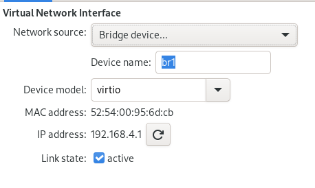
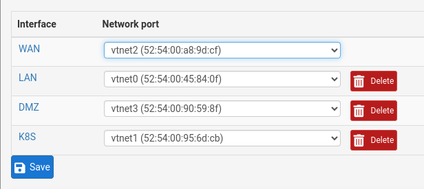
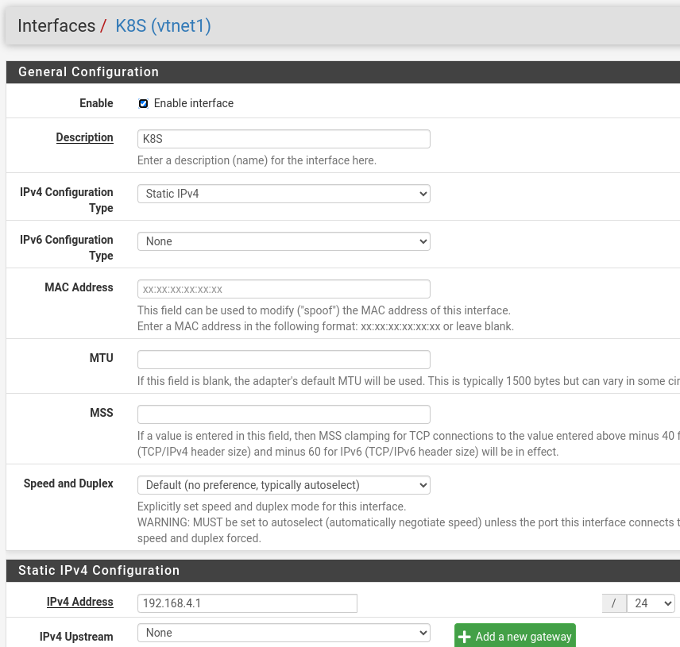

PFSense K8S Network
=======================

What are we trying to achieve here?
------------------------------------------------
We want to create a network that can span both virtual and physical nodes, managed from PFSense.

My network
----------------
Well, my network setup is ... let's say... janky


The PFSense VM is running DHCP and DNS forwarding. 

So, the connection from my local workstation to say `k8snode1` is as follows

1. Local workstation 
   * WIFI
2. ASUS RT-AX92U mesh unit3 (192.168.2.32)
   * WIFI
3. ASUS RT-AX92U mesh unit2 (192.168.2.37)
   * WIFI
4. ASUS RT-AX92U mesh unit1 (192.168.2.6)
    * Ethernet
5. Server eno1 -> bridge0 -> PFSense (LAN/192.168.2.1)
    * Internal routing to (K8S/192.168.4.1) 
6. bridge1 -> Server enp0s20f0u5c2 
    * Ethernet
7. AXE5400 Router (192.168.4.3)
   * WIFI
8. AX11000 Router (192.168.4.5)
   * Ethernet
9. `k8snode1` (192.168.4.10)

Why did it create this abomination? Well, first of, you play with the hardware you got, not the hardware you want. 

I have 3 ASUS routers that can mesh, so they are my normal LAN network. I live in the kind of building where one router cannot cover the entire apartment, so mesh is nessesary.

I was given two TP-Link routers. Of course, they cannot do mesh with ASUS, or even with each other... TP-Link, how you never fail to disappoint.
AXE5400 is set to Access Point mode, and the DHCP server is disabled. It provides the WI-FI Network `K8S`
The AX11000 is also set to Access Point Mode, but before setting it to this, I could set up is WI-FI Gateway. This setting persists when the device is set to Access Point Mode, but disappears from the menu. 

As for the USB3 Ethernet interface... Well, the server only has two network interfaces, and I use both. So a extra network interface was needed, and this seems to work well enough.

I want my Kubernetes cluster to consist of both VMs and physical nodes. Furthermore I want the physical nodes to be placed in a nearby shed. Thus, I need to have WI-FI connection to the nodes. But I do NOT want the Kubernetes system to have to deal with WI-FI connection. Kubernetes networking is complex enough as it is. Thus, by using two WI-FI Routers, I could isolate Kubernetes from WI-FI. 

How was this set up
--------------------------------
First, we need to create the brigde1 device so we can forward it into the PFSense VM 

So, we need to find it's device name
```
[root@server ~]# nmcli dev 
DEVICE         TYPE      STATE                   CONNECTION  
br0            bridge    connected               LAN         
br1            bridge    connected               K8S         
virbr1         bridge    connected (externally)  virbr1      
vnet0          tun       connected (externally)  vnet0       
vnet1          tun       connected (externally)  vnet1       
vnet2          tun       connected (externally)  vnet2       
vnet3          tun       connected (externally)  vnet3       
vnet4          tun       connected (externally)  vnet4       
eno1           ethernet  connected               eno1        
enp0s20f0u5c2  ethernet  disconnected            --          
enp3s0         ethernet  disconnected            --          
wlo1           wifi      disconnected            --          
p2p-dev-wlo1   wifi-p2p  disconnected            --          
lo             loopback  unmanaged               --          
macvtap0       macvlan   unmanaged               --          
[root@server ~]# 
```

The relevant device is `enp0s20f0u5c2`
This is the device we need to bridge

(You might wonder why the enp3s0 is `disconnected`. This is the WAN device, which is wholy managed by PFSense. So, disconnected here does NOT mean physically disconnected, but rather than `NetworkManager` does not handle it)

This is a script I developed (aka stole) some time ago to do just that, i.e. create a network bridge.

The actual work has to happen inside a here-block as you might lose the connection to the server during the operation.


```bash

export DEVICE=enp0s20f0u5c2
export MAIN_CONNECTION=enp0s20f0u5
export BRIDGE_INTERFACE_NAME=br1
export LOCAL_CONNECTION=K8S
export LOCAL_IP="192.168.4.2/24"
export GATEWAY="192.168.4.1"
export DNS_SERVER="$GATEWAY"

bash -x <<EOS
systemctl stop libvirtd

# Delete the connection if it already exists
nmcli con delete "$MAIN_CONNECTION"

# Create the bridge interface and the corresponding local connection
nmcli con add \
  type bridge \
  ifname "$BRIDGE_INTERFACE_NAME" \
  autoconnect yes \
  con-name "$LOCAL_CONNECTION" \
  stp off

# Modify the local connection to have the specified IP and gateway
nmcli con modify "$LOCAL_CONNECTION" \
  ipv4.addresses "$LOCAL_IP" \
  ipv4.method manual \
  ipv4.gateway "$GATEWAY" \
  ipv4.dns "$DNS_SERVER"

# Connect the bridge interface to the actual network interface
nmcli con add \
  type bridge-slave \
  autoconnect yes \
  con-name "$MAIN_CONNECTION" \
  ifname "$DEVICE" \
  master "$BRIDGE_INTERFACE_NAME"

systemctl restart NetworkManager
systemctl start libvirtd

# Nessesary to for bridging to work 
echo "net.ipv4.ip_forward = 1" | sudo tee /etc/sysctl.d/99-ipforward.conf
sysctl -p /etc/sysctl.d/99-ipforward.conf

EOS
```

This creates a bridge interface, and connects the host to the bridge

You can then add this network to any VM on the host like this:


PFSense configuration
================================================================

Network Interface
----------------------------------------------------------------
In PFSense, you can then assign this interface


Note that in the VM, the devices will all be named vtnetX, probably in the order they are listed in the libvirt configuration. The best way to ensure that the correct device is assigned is to compare MAC addresses.

Now that we have the interface, we must define it's properties



We give it the ip address `192.168.4.1/24`, which makes it the gateway for the server machine (see above)

TODO
------------- 
* [ ] DNS Forwarder
* [ ] DHCP
* [ ] Routing rules
