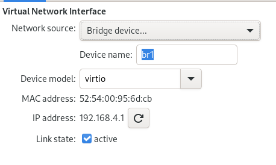

PFSense K8S Network
=======================

What are we trying to achieve here?

Well, my network setup is ... let's say... janky


```
[root@server ~]# nmcli dev 
DEVICE         TYPE      STATE                   CONNECTION  
br0            bridge    connected               LAN         
br1            bridge    connected               K8S         
virbr1         bridge    connected (externally)  virbr1      
vnet0          tun       connected (externally)  vnet0       
vnet1          tun       connected (externally)  vnet1       
vnet2          tun       connected (externally)  vnet2       
vnet3          tun       connected (externally)  vnet3       
vnet4          tun       connected (externally)  vnet4       
eno1           ethernet  connected               eno1        
enp0s20f0u5c2  ethernet  connected               enp0s20f0u5 
enp3s0         ethernet  disconnected            --          
wlo1           wifi      disconnected            --          
p2p-dev-wlo1   wifi-p2p  disconnected            --          
lo             loopback  unmanaged               --          
macvtap0       macvlan   unmanaged               --          
[root@server ~]# 
```

The relevant device is `enp0s20f0u5c2`
This is the device we need to bridge

This is a script I developed (stole) some time ago to do just that.

The actual work has to happen inside a here-block as you might lose the connection to the server.


```bash

export DEVICE=enp0s20f0u5c2
export MAIN_CONNECTION=enp0s20f0u5
export BRIDGE_INTERFACE_NAME=br1
export LOCAL_CONNECTION=K8S
export LOCAL_IP="192.168.4.2/24"
export GATEWAY="192.168.4.1"

bash -x <<EOS
systemctl stop libvirtd

nmcli con delete "$MAIN_CONNECTION"
nmcli con add \
  type bridge \
  ifname "$BRIDGE_INTERFACE_NAME" \
  autoconnect yes \
  con-name "$LOCAL_CONNECTION" \
  stp off
nmcli con modify "$LOCAL_CONNECTION" \
  ipv4.addresses "$LOCAL_IP" \
  ipv4.method manual \
  ipv4.gateway "$GATEWAY" \
  ipv4.dns "$GATEWAY"
nmcli con add \
  type bridge-slave \
  autoconnect yes \
  con-name "$MAIN_CONNECTION" \
  ifname "$DEVICE" \
  master "$BRIDGE_INTERFACE_NAME"

systemctl restart NetworkManager
systemctl start libvirtd
systemctl enable libvirtd

echo "net.ipv4.ip_forward = 1" | sudo tee /etc/sysctl.d/99-ipforward.conf
sysctl -p /etc/sysctl.d/99-ipforward.conf

EOS
```

You can then add this network to any VM on the host like this:
