Virtual Machine Setup
================================================

We want to use Virtual Machines for the master nodes.
The master nodes do not need to be powerful; rather they need to be fast. So they should be kept free of any resource-intensive processes, that could block or slow them.

Reasoning
--------------------------------
It has proven supprisingly difficult to procure sufficiently small and cheap machines. Most cheap computers sold have way too many resources and are thus to power-intensive.

So we have opted for virtualization for the master nodes, as this will allow us to place multiple virtual machines on a single machine.
As the master nodes will not be executing user processes, the overhead with virtualization will not matter much.

Secondly, backing up and restoring virtual machines is a lot easier than for physical systems. The fact that the hypervisor gives me a "Management Engine"/Console access to the VM, and that I can snapshot and restore the entire VM makes backup a breeze.


New VM creation
--------------------------------

I already have a LibVirt system running, which I will use. I will detail how this is set up in another guide.


To create a new VM, follow these steps in `virt-manager`

### LibVirt VM creation

#### Create
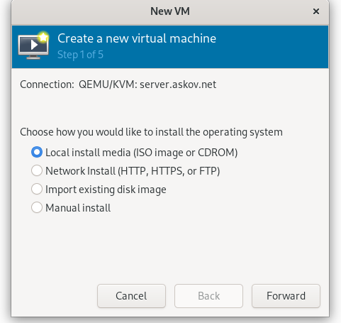

#### ISO
I have a Rocky 9.1 ISO on the server already. I know that we are at 9.4, but I can update the machine after creation, so I might as well just install it with 9.1
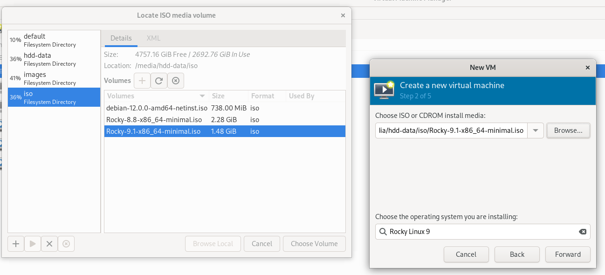

#### Resources
We can change these later, so just fill in some reasonable values
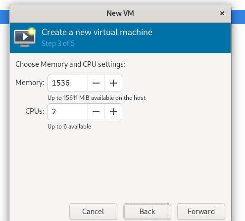

#### Storage
I give the machine 20GB of storage from the SSD storage on the server. A K8S node rarely need a lot of storage 
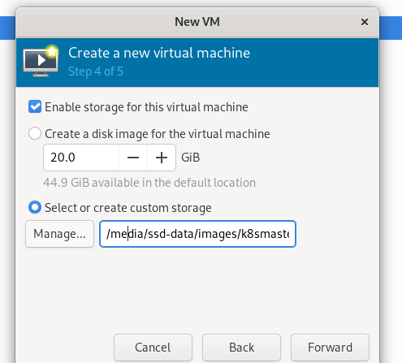

#### Network Interface
Attach the VM to the `br1` bridge we created earlier.
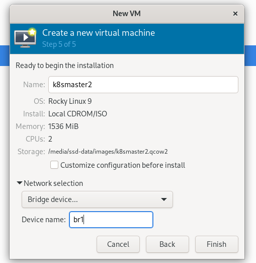


### Rocky Install
Choose English as the language you want. Always do this.
If (when) something fails (with an error message), you will want to search the net for this message. This only works best for the messages in their original format.


#### Install initial screen

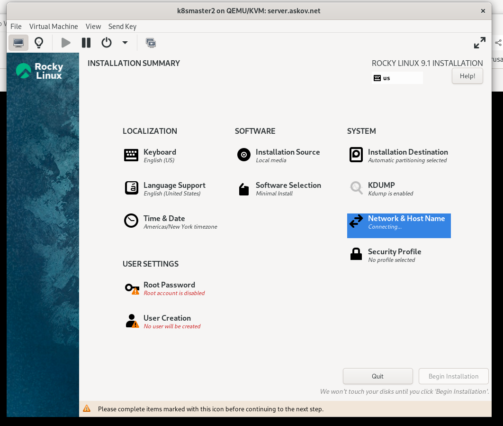

#### Network setup

Initially the network is not configured properly
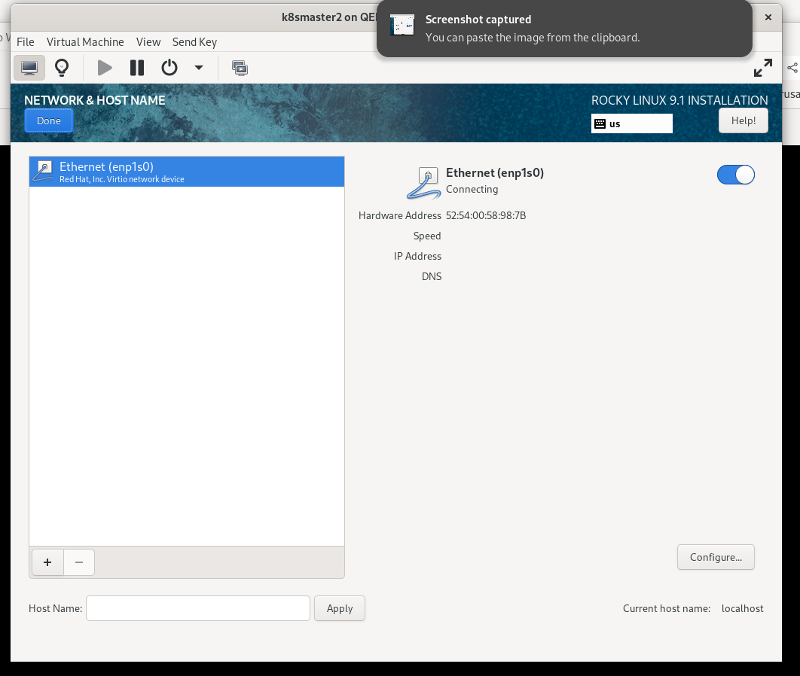

Set up the IPv4. `192.168.4.1` is the Gateway and DNS Server. Pick an unsused IPv4 address.
It is a good practice to let server machines pick their own IPv4 address, rather than using DHCP. This ensures that the machine will remain on the same IP forever, simplifying routing and DNS resolution. Furthermore, the network will function, even if the DHCP server goes bad (like with multiple DHCP servers on the network). 
```
ipv4.method:                            manual
ipv4.dns:                               192.168.4.1
ipv4.dns-search:                        k8s.askov.net,askov.net
ipv4.addresses:                         192.168.4.6/24
ipv4.gateway:                           192.168.4.1
```
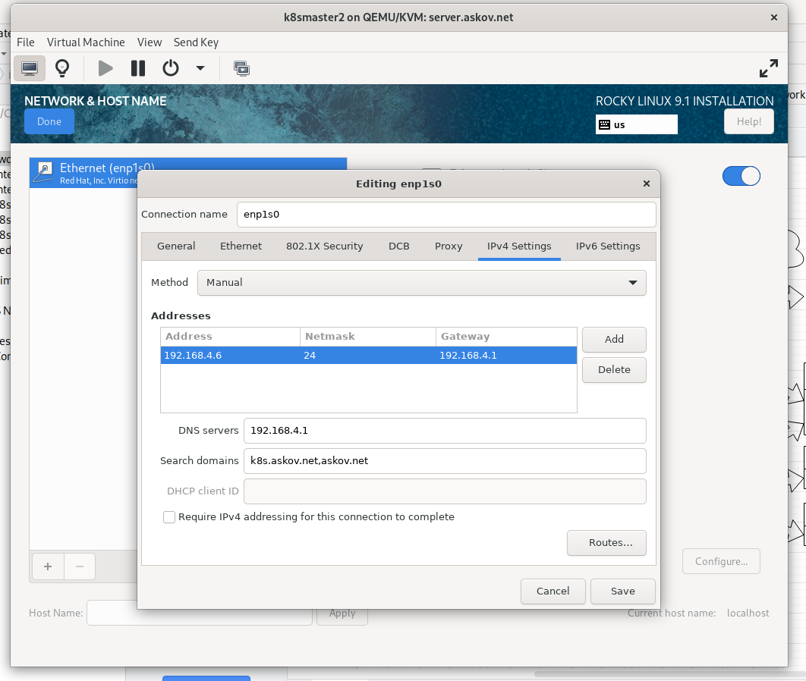

Set the hostname and connect the network.
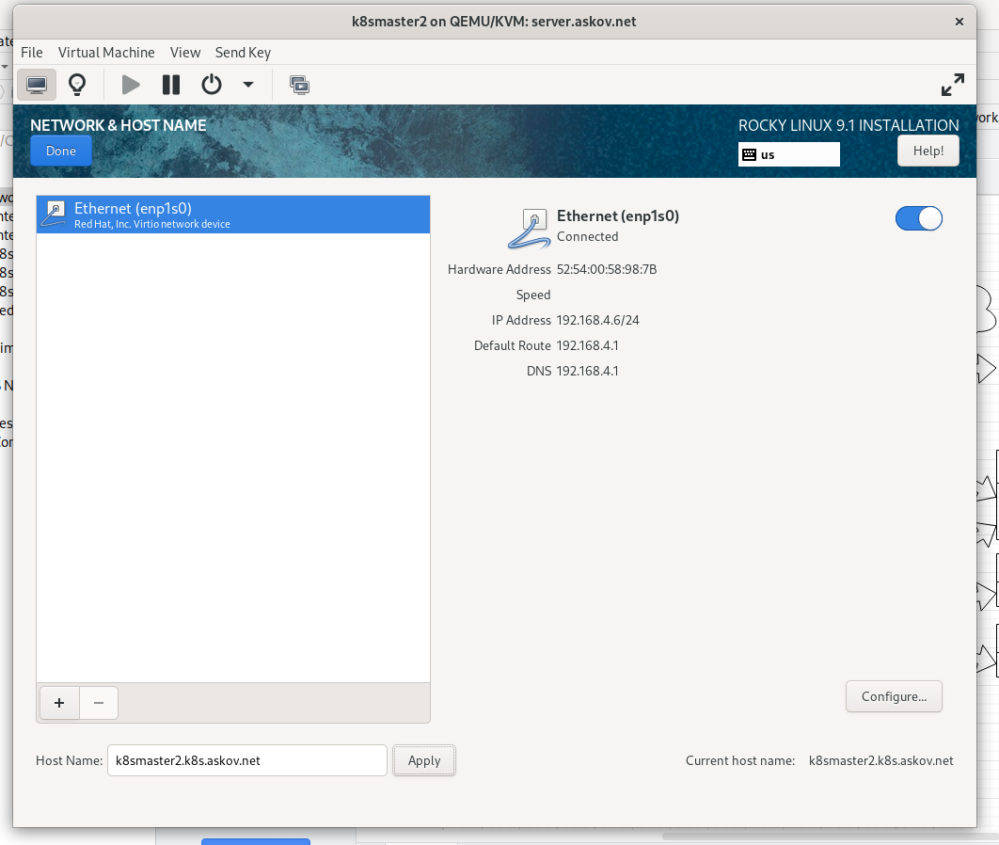


#### User accounts
I usuallly lock the root account, or at least prevent remote access to this.

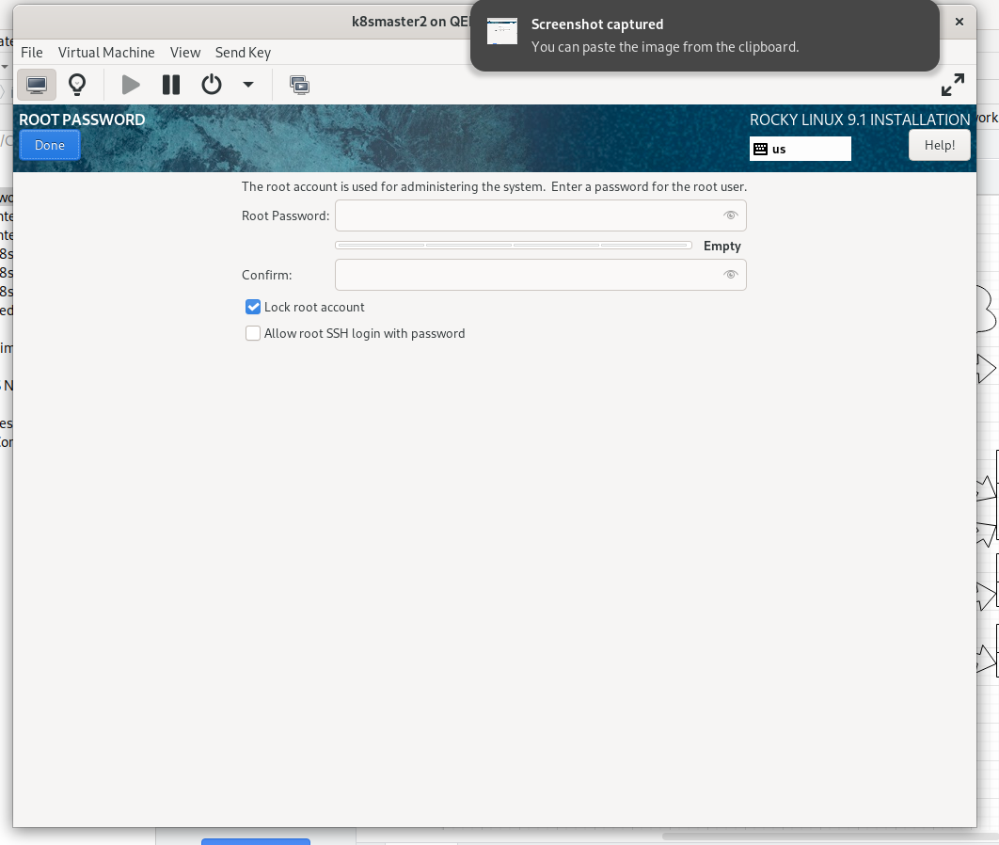

So I need a user account with administrator permissions
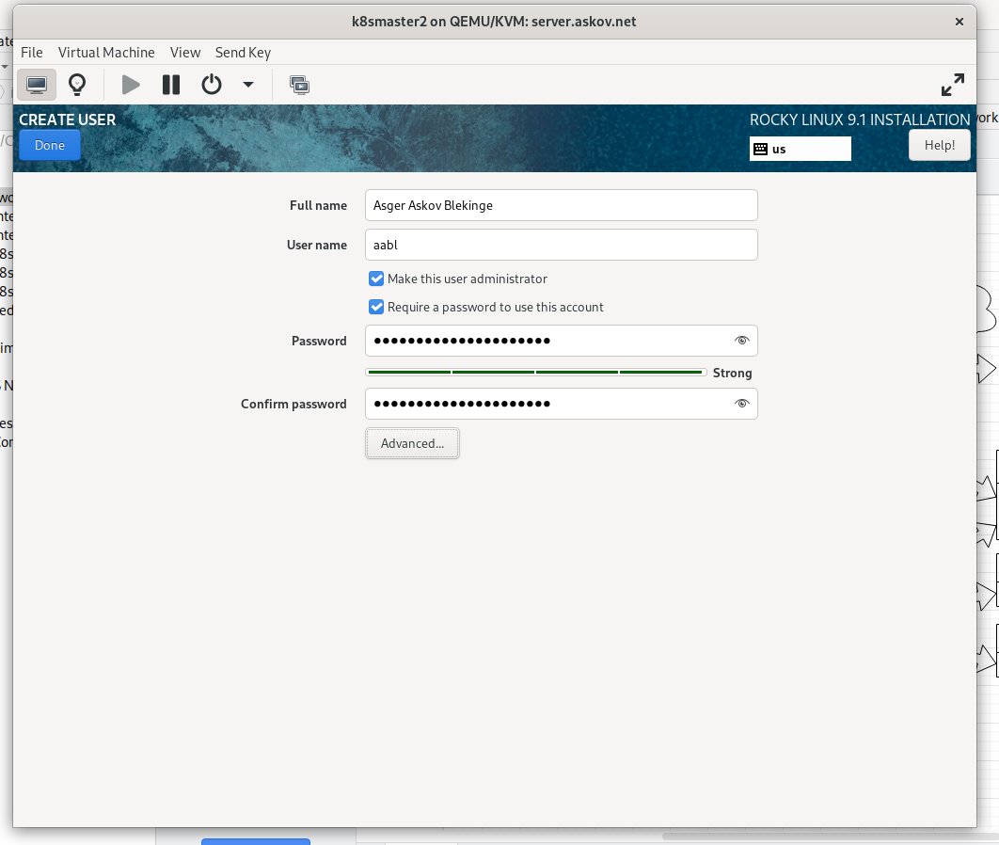

#### Software selection

The standard should be sufficient. The only thing you really want to be sure of is `openssh-server`. Anything else can be installed afterwards. (Yes, we can still use the LibVirt console access to login and install `openssh-server`, but that is a fallback)

I do not quite know what the 
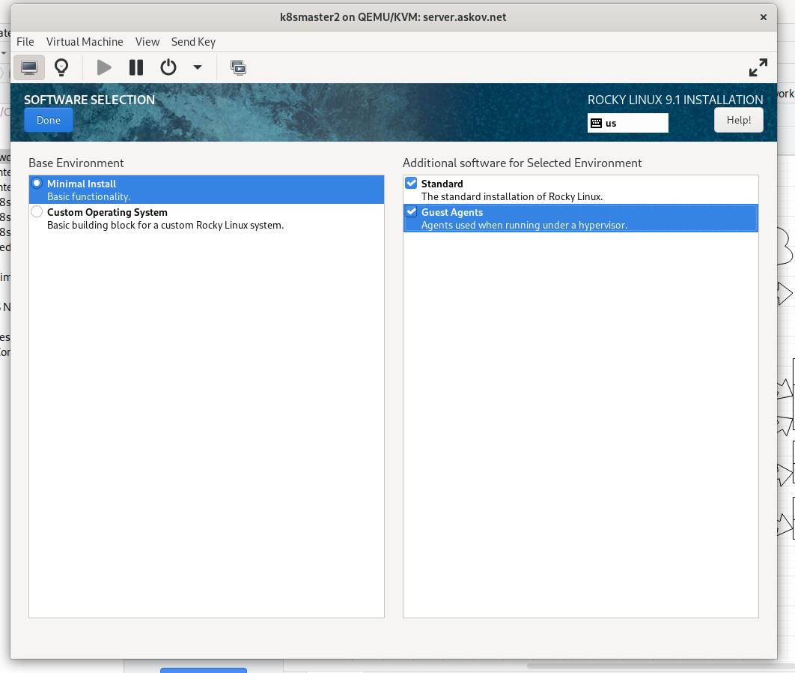

```bash
ping 192.168.4.6

ssh 192.168.4.6

ssh-copy-id 192.168.4.6

ssh 192.168.4.6


sudo dnf update
```